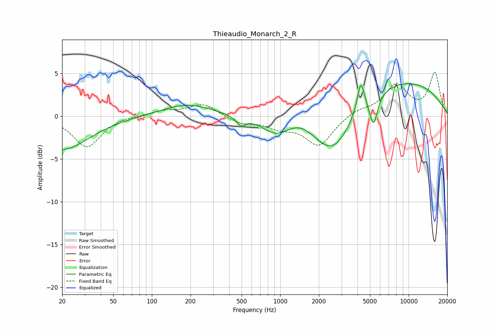

# Thieaudio_Monarch_2_R
See [usage instructions](https://github.com/jaakkopasanen/AutoEq#usage) for more options and info.

### Parametric EQs
Apply preamp of -3.9 dB when using parametric equalizer.

|   # | Type    |   Fc (Hz) |    Q |   Gain (dB) |
|-----|---------|-----------|------|-------------|
|   1 | Peaking |        20 | 0.68 |        -3.9 |
|   2 | Peaking |       189 | 0.73 |         1.4 |
|   3 | Peaking |       495 | 3.92 |        -1   |
|   4 | Peaking |       911 | 1.43 |        -1.8 |
|   5 | Peaking |      1454 | 1.69 |         0.6 |
|   6 | Peaking |      2585 | 0.93 |        -5.7 |
|   7 | Peaking |      4239 | 5.05 |         3.6 |
|   8 | Peaking |      5230 | 3.43 |        -0.2 |
|   9 | Peaking |      5333 | 4.58 |        -3.2 |
|  10 | Peaking |      8201 | 0.29 |         4.3 |

### Fixed Band EQs
When using fixed band (also called graphic) equalizer, apply preamp of **-5.2 dB** (if available) and set gains manually with these parameters.

|   # | Type    |   Fc (Hz) |    Q |   Gain (dB) |
|-----|---------|-----------|------|-------------|
|   1 | Peaking |        31 | 1.41 |        -3.6 |
|   2 | Peaking |        62 | 1.41 |         0.2 |
|   3 | Peaking |       125 | 1.41 |         0.6 |
|   4 | Peaking |       250 | 1.41 |         1.4 |
|   5 | Peaking |       500 | 1.41 |        -0.8 |
|   6 | Peaking |      1000 | 1.41 |        -1.1 |
|   7 | Peaking |      2000 | 1.41 |        -3.4 |
|   8 | Peaking |      4000 | 1.41 |         0.7 |
|   9 | Peaking |      8000 | 1.41 |         3.6 |
|  10 | Peaking |     16000 | 1.41 |         5   |

### Graphs

