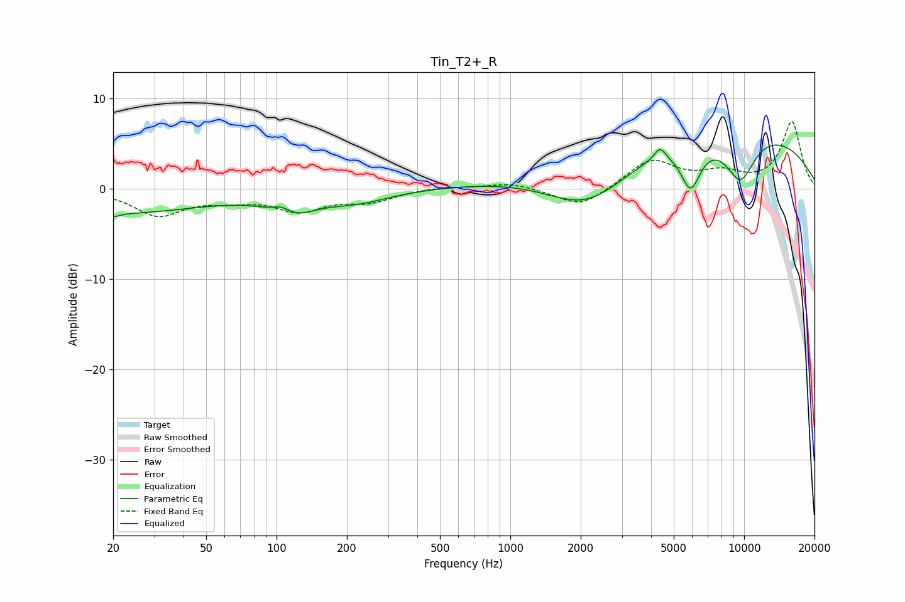

# Tin_T2+_R
See [usage instructions](https://github.com/jaakkopasanen/AutoEq#usage) for more options and info.

### Parametric EQs
Apply preamp of -4.9 dB when using parametric equalizer.

|   # | Type    |   Fc (Hz) |    Q |   Gain (dB) |
|-----|---------|-----------|------|-------------|
|   1 | Peaking |        20 | 5.12 |        -0.4 |
|   2 | Peaking |        21 | 0.39 |        -2.6 |
|   3 | Peaking |       105 | 3.45 |         1   |
|   4 | Peaking |       115 | 1.46 |        -2.3 |
|   5 | Peaking |       221 | 0.98 |        -1.3 |
|   6 | Peaking |      2152 | 0.69 |        -6.8 |
|   7 | Peaking |      4369 | 5.81 |         1.4 |
|   8 | Peaking |      5905 | 3.15 |        -5   |
|   9 | Peaking |      6289 | 0.18 |         7.5 |
|  10 | Peaking |      9638 | 1.91 |        -5.3 |

### Fixed Band EQs
When using fixed band (also called graphic) equalizer, apply preamp of **-7.5 dB** (if available) and set gains manually with these parameters.

|   # | Type    |   Fc (Hz) |    Q |   Gain (dB) |
|-----|---------|-----------|------|-------------|
|   1 | Peaking |        31 | 1.41 |        -2.8 |
|   2 | Peaking |        62 | 1.41 |        -0.9 |
|   3 | Peaking |       125 | 1.41 |        -2.2 |
|   4 | Peaking |       250 | 1.41 |        -1.3 |
|   5 | Peaking |       500 | 1.41 |         0.3 |
|   6 | Peaking |      1000 | 1.41 |         0.7 |
|   7 | Peaking |      2000 | 1.41 |        -2.2 |
|   8 | Peaking |      4000 | 1.41 |         3.2 |
|   9 | Peaking |      8000 | 1.41 |         1.5 |
|  10 | Peaking |     16000 | 1.41 |         7.4 |

### Graphs

