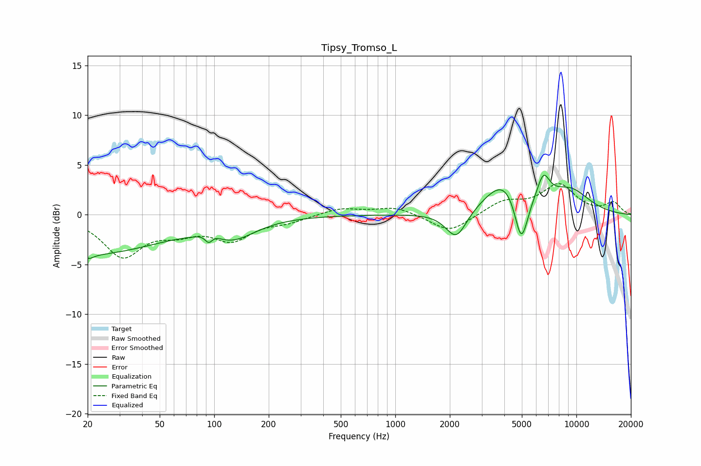

# Tipsy_Tromso_L
See [usage instructions](https://github.com/jaakkopasanen/AutoEq#usage) for more options and info.

### Parametric EQs
Apply preamp of -4.1 dB when using parametric equalizer.

|   # | Type    |   Fc (Hz) |    Q |   Gain (dB) |
|-----|---------|-----------|------|-------------|
|   1 | Peaking |        20 | 0.34 |        -3.9 |
|   2 | Peaking |        20 | 5.32 |        -0.4 |
|   3 | Peaking |        93 | 5.37 |        -2.5 |
|   4 | Peaking |        94 | 4.09 |         2.2 |
|   5 | Peaking |       126 | 1.12 |        -1.9 |
|   6 | Peaking |      2172 | 2.45 |        -2.9 |
|   7 | Peaking |      4092 | 1.24 |         3.7 |
|   8 | Peaking |      4964 | 3.53 |        -5.6 |
|   9 | Peaking |      6580 | 3.95 |         2.4 |
|  10 | Peaking |      9214 | 1.1  |         2.3 |

### Fixed Band EQs
When using fixed band (also called graphic) equalizer, apply preamp of **-3.2 dB** (if available) and set gains manually with these parameters.

|   # | Type    |   Fc (Hz) |    Q |   Gain (dB) |
|-----|---------|-----------|------|-------------|
|   1 | Peaking |        31 | 1.41 |        -4   |
|   2 | Peaking |        62 | 1.41 |        -1.4 |
|   3 | Peaking |       125 | 1.41 |        -2.3 |
|   4 | Peaking |       250 | 1.41 |        -0.6 |
|   5 | Peaking |       500 | 1.41 |         0.7 |
|   6 | Peaking |      1000 | 1.41 |         0.8 |
|   7 | Peaking |      2000 | 1.41 |        -1.8 |
|   8 | Peaking |      4000 | 1.41 |         1.3 |
|   9 | Peaking |      8000 | 1.41 |         2.9 |
|  10 | Peaking |     16000 | 1.41 |         1.2 |

### Graphs

