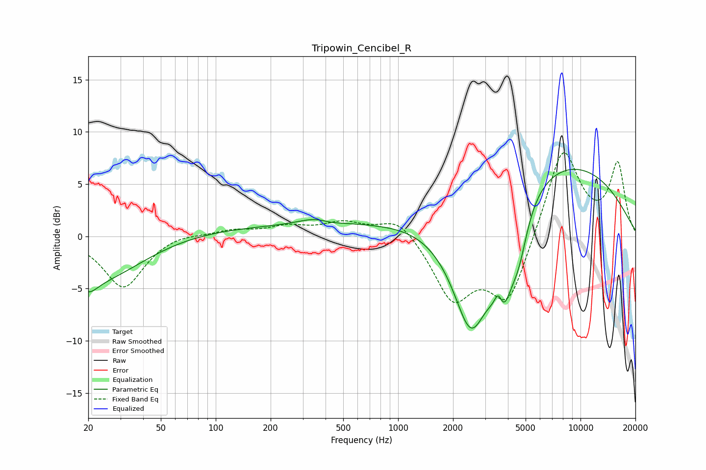

# Tripowin_Cencibel_R
See [usage instructions](https://github.com/jaakkopasanen/AutoEq#usage) for more options and info.

### Parametric EQs
Apply preamp of -6.5 dB when using parametric equalizer.

|   # | Type    |   Fc (Hz) |    Q |   Gain (dB) |
|-----|---------|-----------|------|-------------|
|   1 | Peaking |        20 | 2.83 |        -1.3 |
|   2 | Peaking |        22 | 0.55 |        -4.3 |
|   3 | Peaking |       181 | 0.18 |         1   |
|   4 | Peaking |       361 | 1.38 |         0.8 |
|   5 | Peaking |       425 | 2.39 |        -0.3 |
|   6 | Peaking |      2511 | 1.15 |       -13.6 |
|   7 | Peaking |      3549 | 6    |         2.4 |
|   8 | Peaking |      3728 | 2.4  |        -7.4 |
|   9 | Peaking |      4604 | 2.96 |        -3.4 |
|  10 | Peaking |      5958 | 0.25 |         8.2 |

### Fixed Band EQs
When using fixed band (also called graphic) equalizer, apply preamp of **-8.1 dB** (if available) and set gains manually with these parameters.

|   # | Type    |   Fc (Hz) |    Q |   Gain (dB) |
|-----|---------|-----------|------|-------------|
|   1 | Peaking |        31 | 1.41 |        -5   |
|   2 | Peaking |        62 | 1.41 |         0.4 |
|   3 | Peaking |       125 | 1.41 |         0.6 |
|   4 | Peaking |       250 | 1.41 |         0.8 |
|   5 | Peaking |       500 | 1.41 |         1.2 |
|   6 | Peaking |      1000 | 1.41 |         2   |
|   7 | Peaking |      2000 | 1.41 |        -5.8 |
|   8 | Peaking |      4000 | 1.41 |        -6.4 |
|   9 | Peaking |      8000 | 1.41 |         8.7 |
|  10 | Peaking |     16000 | 1.41 |         6.8 |

### Graphs

