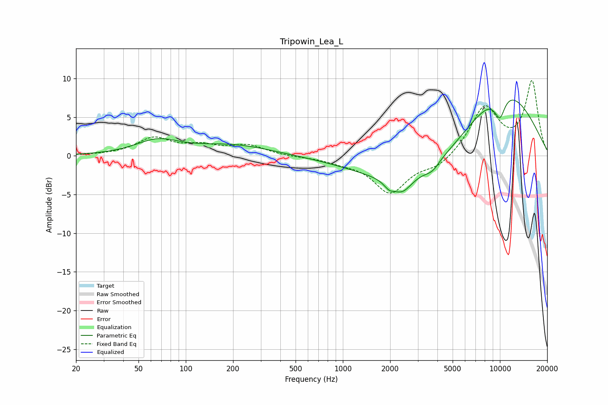

# Tripowin_Lea_L
See [usage instructions](https://github.com/jaakkopasanen/AutoEq#usage) for more options and info.

### Parametric EQs
Apply preamp of -7.3 dB when using parametric equalizer.

|   # | Type    |   Fc (Hz) |    Q |   Gain (dB) |
|-----|---------|-----------|------|-------------|
|   1 | Peaking |        66 | 1.03 |         1.8 |
|   2 | Peaking |       202 | 0.58 |         1.3 |
|   3 | Peaking |      1972 | 4.17 |        -0.9 |
|   4 | Peaking |      2389 | 2.4  |        -1.9 |
|   5 | Peaking |      3130 | 0.4  |        -4.4 |
|   6 | Peaking |      3665 | 3.09 |        -0.7 |
|   7 | Peaking |      3837 | 5.4  |        -0.2 |
|   8 | Peaking |      9685 | 5.39 |         0.4 |
|   9 | Peaking |      9937 | 3.52 |        -3.4 |
|  10 | Peaking |      9995 | 0.46 |         9.5 |

### Fixed Band EQs
When using fixed band (also called graphic) equalizer, apply preamp of **-9.8 dB** (if available) and set gains manually with these parameters.

|   # | Type    |   Fc (Hz) |    Q |   Gain (dB) |
|-----|---------|-----------|------|-------------|
|   1 | Peaking |        31 | 1.41 |         0.1 |
|   2 | Peaking |        62 | 1.41 |         2.2 |
|   3 | Peaking |       125 | 1.41 |         1.1 |
|   4 | Peaking |       250 | 1.41 |         1.3 |
|   5 | Peaking |       500 | 1.41 |        -0.1 |
|   6 | Peaking |      1000 | 1.41 |        -0.6 |
|   7 | Peaking |      2000 | 1.41 |        -4.7 |
|   8 | Peaking |      4000 | 1.41 |        -1.4 |
|   9 | Peaking |      8000 | 1.41 |         6.2 |
|  10 | Peaking |     16000 | 1.41 |         9.5 |

### Graphs

