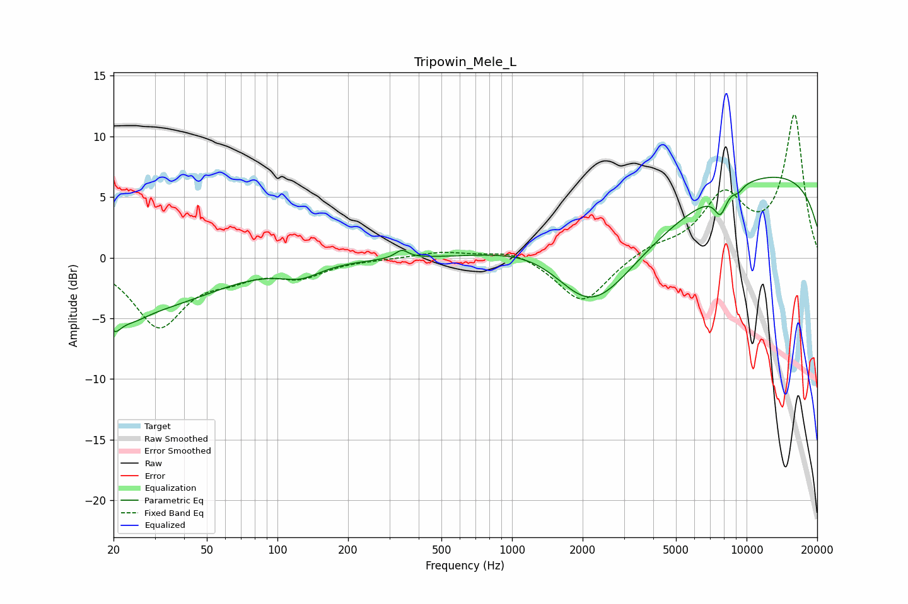

# Tripowin_Mele_L
See [usage instructions](https://github.com/jaakkopasanen/AutoEq#usage) for more options and info.

### Parametric EQs
Apply preamp of -6.7 dB when using parametric equalizer.

|   # | Type    |   Fc (Hz) |    Q |   Gain (dB) |
|-----|---------|-----------|------|-------------|
|   1 | Peaking |        20 | 4.67 |        -2   |
|   2 | Peaking |        23 | 1.73 |        -1.7 |
|   3 | Peaking |        32 | 0.55 |        -3.5 |
|   4 | Peaking |       126 | 1.65 |        -1.1 |
|   5 | Peaking |       339 | 5.2  |         0.7 |
|   6 | Peaking |      1522 | 0.54 |         6.4 |
|   7 | Peaking |      2122 | 0.57 |       -12.5 |
|   8 | Peaking |      7739 | 5.15 |        -1.8 |
|   9 | Peaking |      9240 | 5.99 |        -0.5 |
|  10 | Peaking |     10000 | 0.18 |         7.4 |

### Fixed Band EQs
When using fixed band (also called graphic) equalizer, apply preamp of **-11.9 dB** (if available) and set gains manually with these parameters.

|   # | Type    |   Fc (Hz) |    Q |   Gain (dB) |
|-----|---------|-----------|------|-------------|
|   1 | Peaking |        31 | 1.41 |        -5.5 |
|   2 | Peaking |        62 | 1.41 |        -1.1 |
|   3 | Peaking |       125 | 1.41 |        -1.4 |
|   4 | Peaking |       250 | 1.41 |        -0.1 |
|   5 | Peaking |       500 | 1.41 |         0.5 |
|   6 | Peaking |      1000 | 1.41 |         0.7 |
|   7 | Peaking |      2000 | 1.41 |        -3.9 |
|   8 | Peaking |      4000 | 1.41 |         0.8 |
|   9 | Peaking |      8000 | 1.41 |         4.8 |
|  10 | Peaking |     16000 | 1.41 |        11.6 |

### Graphs

