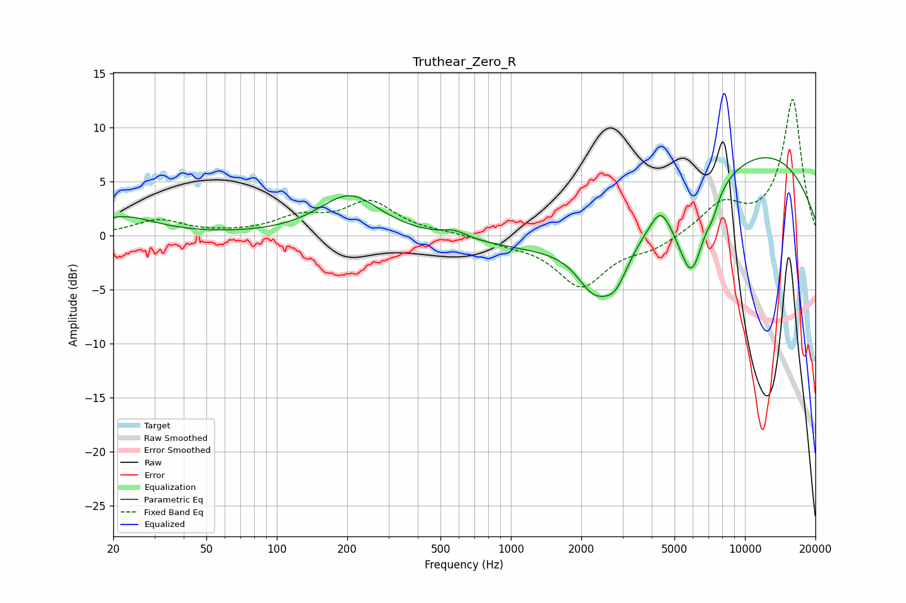

# Truthear_Zero_R
See [usage instructions](https://github.com/jaakkopasanen/AutoEq#usage) for more options and info.

### Parametric EQs
Apply preamp of -7.3 dB when using parametric equalizer.

|   # | Type    |   Fc (Hz) |    Q |   Gain (dB) |
|-----|---------|-----------|------|-------------|
|   1 | Peaking |        22 | 1.03 |         1.7 |
|   2 | Peaking |       205 | 1.09 |         3.8 |
|   3 | Peaking |       575 | 2.54 |         0.7 |
|   4 | Peaking |      2249 | 1.97 |        -3.6 |
|   5 | Peaking |      2795 | 2.4  |        -3.4 |
|   6 | Peaking |      3155 | 0.33 |        -8.2 |
|   7 | Peaking |      4355 | 3.39 |         2.1 |
|   8 | Peaking |      5915 | 2.34 |        -7.7 |
|   9 | Peaking |      7012 | 0.22 |        11.5 |
|  10 | Peaking |      7276 | 5.35 |        -1.1 |

### Fixed Band EQs
When using fixed band (also called graphic) equalizer, apply preamp of **-12.7 dB** (if available) and set gains manually with these parameters.

|   # | Type    |   Fc (Hz) |    Q |   Gain (dB) |
|-----|---------|-----------|------|-------------|
|   1 | Peaking |        31 | 1.41 |         1.4 |
|   2 | Peaking |        62 | 1.41 |         0.1 |
|   3 | Peaking |       125 | 1.41 |         1.5 |
|   4 | Peaking |       250 | 1.41 |         3   |
|   5 | Peaking |       500 | 1.41 |         0.2 |
|   6 | Peaking |      1000 | 1.41 |        -0.5 |
|   7 | Peaking |      2000 | 1.41 |        -4.6 |
|   8 | Peaking |      4000 | 1.41 |        -1.1 |
|   9 | Peaking |      8000 | 1.41 |         2.8 |
|  10 | Peaking |     16000 | 1.41 |        12.6 |

### Graphs

