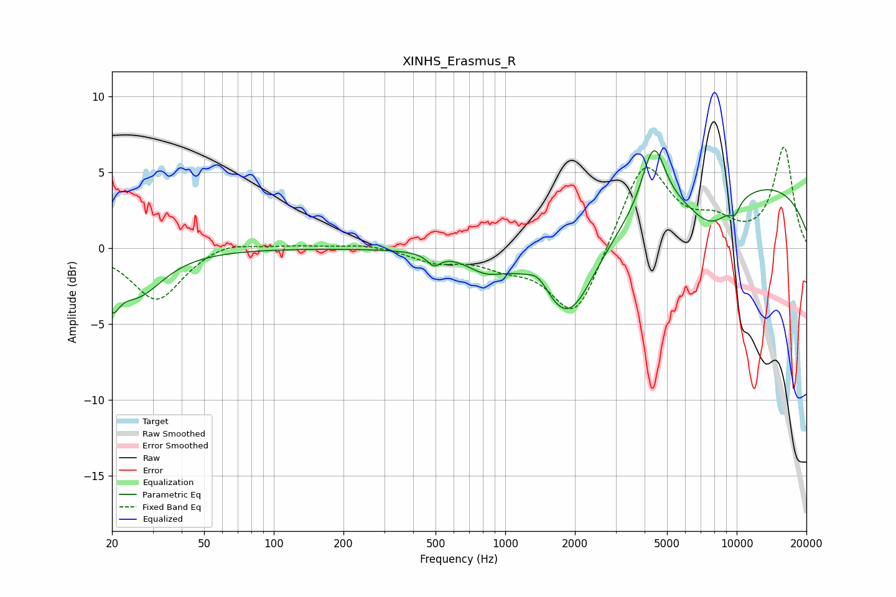

# XINHS_Erasmus_R
See [usage instructions](https://github.com/jaakkopasanen/AutoEq#usage) for more options and info.

### Parametric EQs
Apply preamp of -6.5 dB when using parametric equalizer.

|   # | Type    |   Fc (Hz) |    Q |   Gain (dB) |
|-----|---------|-----------|------|-------------|
|   1 | Peaking |        20 | 4.66 |        -2.1 |
|   2 | Peaking |        26 | 1.28 |        -3   |
|   3 | Peaking |       492 | 5.06 |        -0.8 |
|   4 | Peaking |       823 | 1.68 |        -1.1 |
|   5 | Peaking |      1393 | 3.13 |         1   |
|   6 | Peaking |      1871 | 1.18 |        -5.7 |
|   7 | Peaking |      4379 | 2.82 |         4.4 |
|   8 | Peaking |      7766 | 1.29 |        -2.6 |
|   9 | Peaking |      9821 | 5.79 |        -0.7 |
|  10 | Peaking |     10000 | 0.22 |         4.5 |

### Fixed Band EQs
When using fixed band (also called graphic) equalizer, apply preamp of **-6.7 dB** (if available) and set gains manually with these parameters.

|   # | Type    |   Fc (Hz) |    Q |   Gain (dB) |
|-----|---------|-----------|------|-------------|
|   1 | Peaking |        31 | 1.41 |        -3.5 |
|   2 | Peaking |        62 | 1.41 |         0.6 |
|   3 | Peaking |       125 | 1.41 |         0.2 |
|   4 | Peaking |       250 | 1.41 |         0.3 |
|   5 | Peaking |       500 | 1.41 |        -0.8 |
|   6 | Peaking |      1000 | 1.41 |        -0.9 |
|   7 | Peaking |      2000 | 1.41 |        -4.8 |
|   8 | Peaking |      4000 | 1.41 |         5.9 |
|   9 | Peaking |      8000 | 1.41 |         1.4 |
|  10 | Peaking |     16000 | 1.41 |         6.6 |

### Graphs

