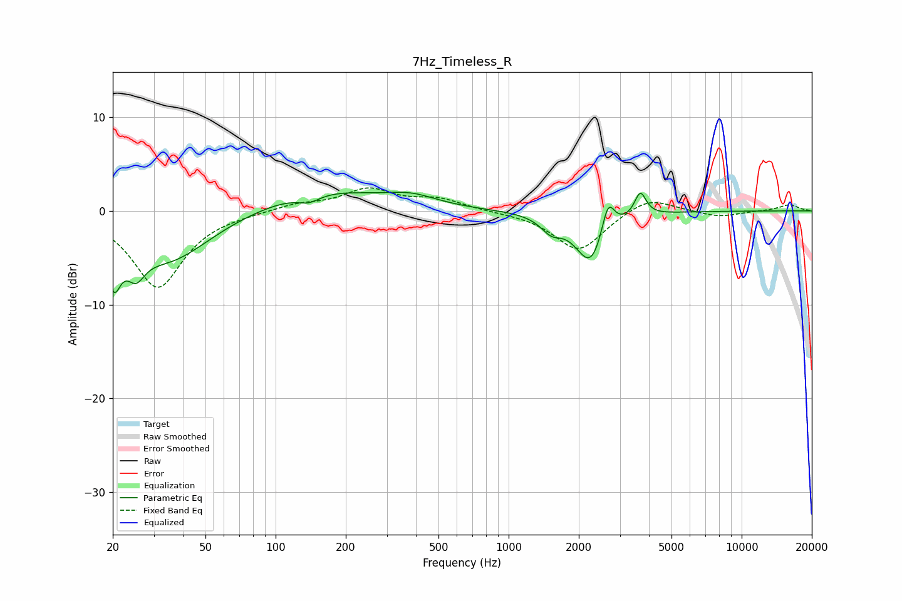

# 7Hz_Timeless_R
See [usage instructions](https://github.com/jaakkopasanen/AutoEq#usage) for more options and info.

### Parametric EQs
Apply preamp of -2.1 dB when using parametric equalizer.

|   # | Type    |   Fc (Hz) |    Q |   Gain (dB) |
|-----|---------|-----------|------|-------------|
|   1 | Peaking |        20 | 4.76 |        -5.1 |
|   2 | Peaking |        25 | 3.69 |        -2.8 |
|   3 | Peaking |        35 | 0.78 |        -5.3 |
|   4 | Peaking |       139 | 2.88 |        -0.9 |
|   5 | Peaking |       155 | 0.57 |         2.3 |
|   6 | Peaking |       383 | 1.26 |         1.1 |
|   7 | Peaking |      1523 | 3.14 |        -1.5 |
|   8 | Peaking |      2263 | 2.16 |        -5.8 |
|   9 | Peaking |      2668 | 4.97 |         3.9 |
|  10 | Peaking |      3674 | 5.79 |         2.6 |

### Fixed Band EQs
When using fixed band (also called graphic) equalizer, apply preamp of **-2.5 dB** (if available) and set gains manually with these parameters.

|   # | Type    |   Fc (Hz) |    Q |   Gain (dB) |
|-----|---------|-----------|------|-------------|
|   1 | Peaking |        31 | 1.41 |        -8.2 |
|   2 | Peaking |        62 | 1.41 |        -0.1 |
|   3 | Peaking |       125 | 1.41 |         0.7 |
|   4 | Peaking |       250 | 1.41 |         2.2 |
|   5 | Peaking |       500 | 1.41 |         1.2 |
|   6 | Peaking |      1000 | 1.41 |        -0.1 |
|   7 | Peaking |      2000 | 1.41 |        -4.3 |
|   8 | Peaking |      4000 | 1.41 |         1.7 |
|   9 | Peaking |      8000 | 1.41 |        -0.7 |
|  10 | Peaking |     16000 | 1.41 |         0.7 |

### Graphs

