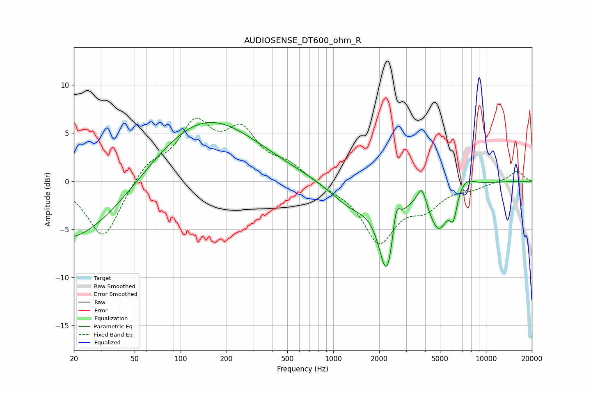

# AUDIOSENSE_DT600_ohm_R
See [usage instructions](https://github.com/jaakkopasanen/AutoEq#usage) for more options and info.

### Parametric EQs
Apply preamp of -6.2 dB when using parametric equalizer.

|   # | Type    |   Fc (Hz) |    Q |   Gain (dB) |
|-----|---------|-----------|------|-------------|
|   1 | Peaking |        20 | 2.34 |        -0.3 |
|   2 | Peaking |        21 | 0.44 |        -6.2 |
|   3 | Peaking |       144 | 0.41 |         6.8 |
|   4 | Peaking |      1308 | 1.02 |        -2.4 |
|   5 | Peaking |      2249 | 2.62 |        -8.6 |
|   6 | Peaking |      2582 | 5.85 |         3.1 |
|   7 | Peaking |      3801 | 5.05 |         2   |
|   8 | Peaking |      4900 | 2.12 |        -4.6 |
|   9 | Peaking |      6127 | 5.93 |        -2.4 |
|  10 | Peaking |      7280 | 2.31 |         1.2 |

### Fixed Band EQs
When using fixed band (also called graphic) equalizer, apply preamp of **-6.7 dB** (if available) and set gains manually with these parameters.

|   # | Type    |   Fc (Hz) |    Q |   Gain (dB) |
|-----|---------|-----------|------|-------------|
|   1 | Peaking |        31 | 1.41 |        -6.1 |
|   2 | Peaking |        62 | 1.41 |         1.9 |
|   3 | Peaking |       125 | 1.41 |         5.5 |
|   4 | Peaking |       250 | 1.41 |         4.7 |
|   5 | Peaking |       500 | 1.41 |         1.5 |
|   6 | Peaking |      1000 | 1.41 |        -0.6 |
|   7 | Peaking |      2000 | 1.41 |        -6.1 |
|   8 | Peaking |      4000 | 1.41 |        -2.3 |
|   9 | Peaking |      8000 | 1.41 |        -0.6 |
|  10 | Peaking |     16000 | 1.41 |         1.1 |

### Graphs

