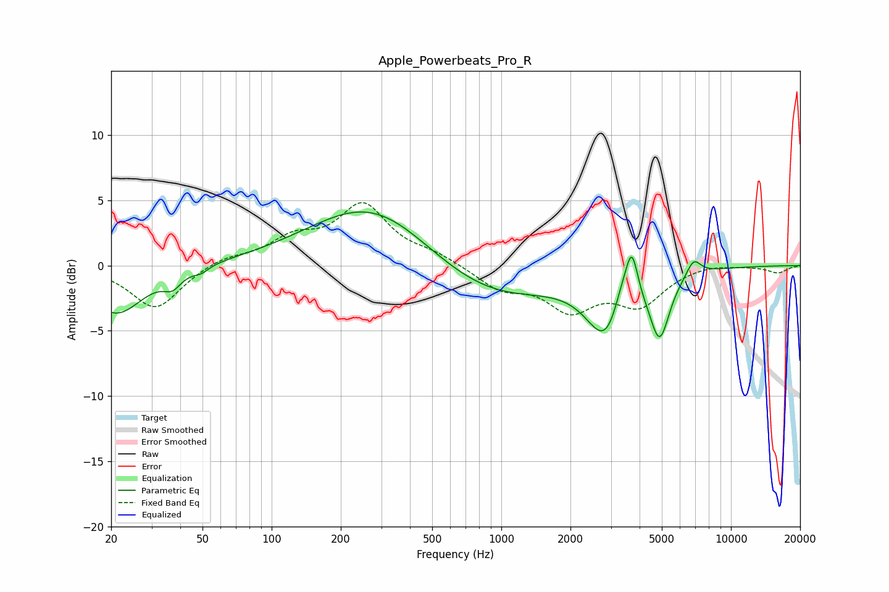

# Apple_Powerbeats_Pro_R
See [usage instructions](https://github.com/jaakkopasanen/AutoEq#usage) for more options and info.

### Parametric EQs
Apply preamp of -4.2 dB when using parametric equalizer.

|   # | Type    |   Fc (Hz) |    Q |   Gain (dB) |
|-----|---------|-----------|------|-------------|
|   1 | Peaking |        21 | 1.21 |        -3.7 |
|   2 | Peaking |        37 | 3.73 |        -1   |
|   3 | Peaking |        49 | 4.52 |        -0.4 |
|   4 | Peaking |       281 | 0.52 |         5.2 |
|   5 | Peaking |       834 | 0.48 |        -3.1 |
|   6 | Peaking |      2874 | 1.69 |        -5   |
|   7 | Peaking |      3346 | 3.52 |         2   |
|   8 | Peaking |      3702 | 5.36 |         3.6 |
|   9 | Peaking |      4892 | 3.26 |        -4.8 |
|  10 | Peaking |      6875 | 4.29 |         1.3 |

### Fixed Band EQs
When using fixed band (also called graphic) equalizer, apply preamp of **-4.9 dB** (if available) and set gains manually with these parameters.

|   # | Type    |   Fc (Hz) |    Q |   Gain (dB) |
|-----|---------|-----------|------|-------------|
|   1 | Peaking |        31 | 1.41 |        -3.4 |
|   2 | Peaking |        62 | 1.41 |         0.6 |
|   3 | Peaking |       125 | 1.41 |         1.8 |
|   4 | Peaking |       250 | 1.41 |         4.5 |
|   5 | Peaking |       500 | 1.41 |         0.7 |
|   6 | Peaking |      1000 | 1.41 |        -1.6 |
|   7 | Peaking |      2000 | 1.41 |        -3.1 |
|   8 | Peaking |      4000 | 1.41 |        -2.8 |
|   9 | Peaking |      8000 | 1.41 |         0.2 |
|  10 | Peaking |     16000 | 1.41 |        -0.5 |

### Graphs

