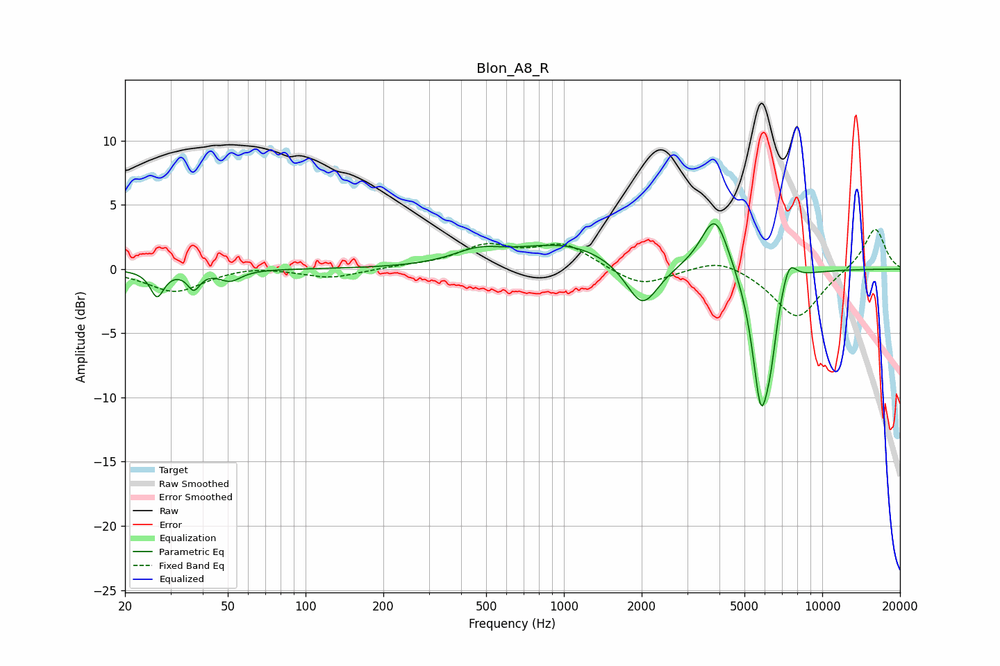

# Blon_A8_R
See [usage instructions](https://github.com/jaakkopasanen/AutoEq#usage) for more options and info.

### Parametric EQs
Apply preamp of -3.6 dB when using parametric equalizer.

|   # | Type    |   Fc (Hz) |    Q |   Gain (dB) |
|-----|---------|-----------|------|-------------|
|   1 | Peaking |        27 | 5.53 |        -2   |
|   2 | Peaking |        37 | 6    |        -1.4 |
|   3 | Peaking |        51 | 3.4  |        -0.9 |
|   4 | Peaking |       465 | 1.47 |         1   |
|   5 | Peaking |      1016 | 0.73 |         1.9 |
|   6 | Peaking |      2011 | 2.26 |        -3.6 |
|   7 | Peaking |      3846 | 2.59 |         4.5 |
|   8 | Peaking |      5793 | 3.86 |       -10.5 |
|   9 | Peaking |      6321 | 6    |        -2.6 |
|  10 | Peaking |      7429 | 4.66 |         2   |

### Fixed Band EQs
When using fixed band (also called graphic) equalizer, apply preamp of **-3.2 dB** (if available) and set gains manually with these parameters.

|   # | Type    |   Fc (Hz) |    Q |   Gain (dB) |
|-----|---------|-----------|------|-------------|
|   1 | Peaking |        31 | 1.41 |        -1.8 |
|   2 | Peaking |        62 | 1.41 |         0.3 |
|   3 | Peaking |       125 | 1.41 |        -0.7 |
|   4 | Peaking |       250 | 1.41 |         0.2 |
|   5 | Peaking |       500 | 1.41 |         1.7 |
|   6 | Peaking |      1000 | 1.41 |         1.9 |
|   7 | Peaking |      2000 | 1.41 |        -1.4 |
|   8 | Peaking |      4000 | 1.41 |         1   |
|   9 | Peaking |      8000 | 1.41 |        -3.9 |
|  10 | Peaking |     16000 | 1.41 |         3.3 |

### Graphs

