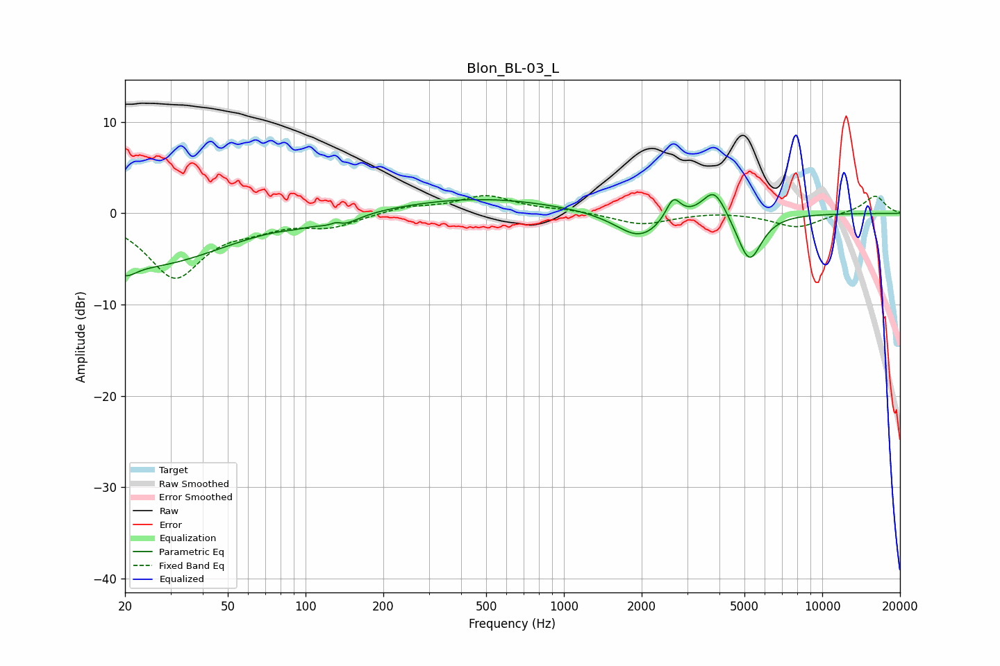

# Blon_BL-03_L
See [usage instructions](https://github.com/jaakkopasanen/AutoEq#usage) for more options and info.

### Parametric EQs
Apply preamp of -2.1 dB when using parametric equalizer.

|   # | Type    |   Fc (Hz) |    Q |   Gain (dB) |
|-----|---------|-----------|------|-------------|
|   1 | Peaking |        20 | 3.37 |        -1.6 |
|   2 | Peaking |        25 | 0.49 |        -5.5 |
|   3 | Peaking |        91 | 2.74 |        -0.3 |
|   4 | Peaking |       131 | 5.83 |         0.6 |
|   5 | Peaking |       135 | 2.35 |        -1.3 |
|   6 | Peaking |       465 | 0.46 |         1.7 |
|   7 | Peaking |      1963 | 1.55 |        -2.9 |
|   8 | Peaking |      2650 | 4.87 |         2.5 |
|   9 | Peaking |      3819 | 2.99 |         3.3 |
|  10 | Peaking |      5225 | 2.93 |        -5.4 |

### Fixed Band EQs
When using fixed band (also called graphic) equalizer, apply preamp of **-2.0 dB** (if available) and set gains manually with these parameters.

|   # | Type    |   Fc (Hz) |    Q |   Gain (dB) |
|-----|---------|-----------|------|-------------|
|   1 | Peaking |        31 | 1.41 |        -6.9 |
|   2 | Peaking |        62 | 1.41 |        -1.1 |
|   3 | Peaking |       125 | 1.41 |        -1.3 |
|   4 | Peaking |       250 | 1.41 |         0.7 |
|   5 | Peaking |       500 | 1.41 |         1.9 |
|   6 | Peaking |      1000 | 1.41 |         0.3 |
|   7 | Peaking |      2000 | 1.41 |        -1.3 |
|   8 | Peaking |      4000 | 1.41 |         0.2 |
|   9 | Peaking |      8000 | 1.41 |        -1.6 |
|  10 | Peaking |     16000 | 1.41 |         1.9 |

### Graphs

