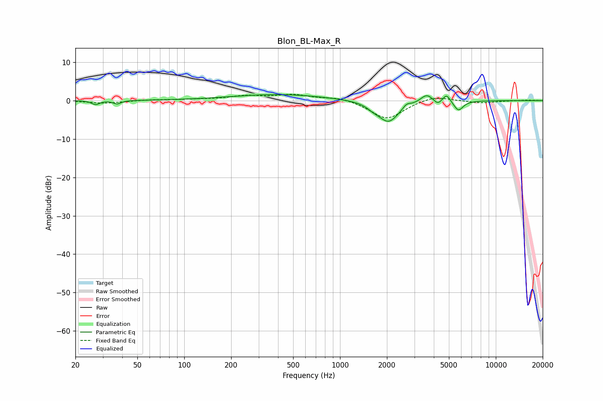

# Blon_BL-Max_R
See [usage instructions](https://github.com/jaakkopasanen/AutoEq#usage) for more options and info.

### Parametric EQs
Apply preamp of -1.6 dB when using parametric equalizer.

|   # | Type    |   Fc (Hz) |    Q |   Gain (dB) |
|-----|---------|-----------|------|-------------|
|   1 | Peaking |        27 | 5.99 |        -1   |
|   2 | Peaking |        37 | 6    |        -0.9 |
|   3 | Peaking |       404 | 0.47 |         1.6 |
|   4 | Peaking |      1627 | 4.03 |        -0.7 |
|   5 | Peaking |      2045 | 2.06 |        -5.6 |
|   6 | Peaking |      2674 | 6    |         1.1 |
|   7 | Peaking |      3595 | 3.72 |         2.1 |
|   8 | Peaking |      4243 | 6    |        -1.2 |
|   9 | Peaking |      4830 | 6    |         2   |
|  10 | Peaking |      5756 | 4.64 |        -2.6 |

### Fixed Band EQs
When using fixed band (also called graphic) equalizer, apply preamp of **-1.7 dB** (if available) and set gains manually with these parameters.

|   # | Type    |   Fc (Hz) |    Q |   Gain (dB) |
|-----|---------|-----------|------|-------------|
|   1 | Peaking |        31 | 1.41 |        -0.7 |
|   2 | Peaking |        62 | 1.41 |         0.2 |
|   3 | Peaking |       125 | 1.41 |         0.2 |
|   4 | Peaking |       250 | 1.41 |         1.1 |
|   5 | Peaking |       500 | 1.41 |         1.4 |
|   6 | Peaking |      1000 | 1.41 |         0.9 |
|   7 | Peaking |      2000 | 1.41 |        -4.9 |
|   8 | Peaking |      4000 | 1.41 |         1.4 |
|   9 | Peaking |      8000 | 1.41 |        -0.6 |
|  10 | Peaking |     16000 | 1.41 |         0.1 |

### Graphs

