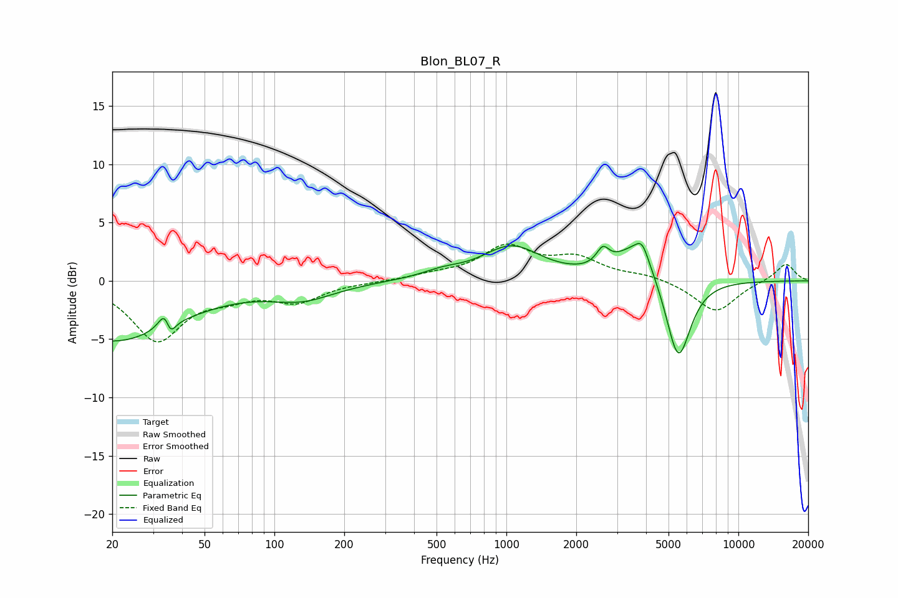

# Blon_BL07_R
See [usage instructions](https://github.com/jaakkopasanen/AutoEq#usage) for more options and info.

### Parametric EQs
Apply preamp of -3.3 dB when using parametric equalizer.

|   # | Type    |   Fc (Hz) |    Q |   Gain (dB) |
|-----|---------|-----------|------|-------------|
|   1 | Peaking |        20 | 0.49 |        -5.2 |
|   2 | Peaking |        34 | 5.46 |         3.5 |
|   3 | Peaking |        35 | 6    |        -3.2 |
|   4 | Peaking |       132 | 1.01 |        -1.4 |
|   5 | Peaking |       526 | 1.6  |         0.6 |
|   6 | Peaking |      1052 | 1.12 |         2.9 |
|   7 | Peaking |      2604 | 5.27 |         1.4 |
|   8 | Peaking |      3664 | 1.55 |         3.1 |
|   9 | Peaking |      3845 | 5.26 |         1.3 |
|  10 | Peaking |      5505 | 2.56 |        -7.4 |

### Fixed Band EQs
When using fixed band (also called graphic) equalizer, apply preamp of **-3.2 dB** (if available) and set gains manually with these parameters.

|   # | Type    |   Fc (Hz) |    Q |   Gain (dB) |
|-----|---------|-----------|------|-------------|
|   1 | Peaking |        31 | 1.41 |        -5   |
|   2 | Peaking |        62 | 1.41 |        -1   |
|   3 | Peaking |       125 | 1.41 |        -1.7 |
|   4 | Peaking |       250 | 1.41 |        -0.1 |
|   5 | Peaking |       500 | 1.41 |         0.4 |
|   6 | Peaking |      1000 | 1.41 |         2.8 |
|   7 | Peaking |      2000 | 1.41 |         1.7 |
|   8 | Peaking |      4000 | 1.41 |         0.5 |
|   9 | Peaking |      8000 | 1.41 |        -2.7 |
|  10 | Peaking |     16000 | 1.41 |         1.5 |

### Graphs

