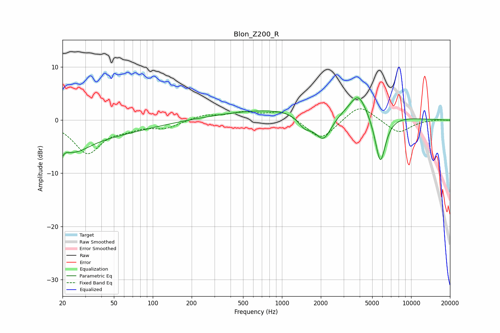

# Blon_Z200_R
See [usage instructions](https://github.com/jaakkopasanen/AutoEq#usage) for more options and info.

### Parametric EQs
Apply preamp of -4.3 dB when using parametric equalizer.

|   # | Type    |   Fc (Hz) |    Q |   Gain (dB) |
|-----|---------|-----------|------|-------------|
|   1 | Peaking |        20 | 5.37 |        -4.4 |
|   2 | Peaking |        20 | 0.23 |        -3.5 |
|   3 | Peaking |        20 | 5.97 |         2.9 |
|   4 | Peaking |        25 | 1.29 |        -2.4 |
|   5 | Peaking |      1492 | 0.21 |         2.3 |
|   6 | Peaking |      1508 | 2.54 |        -2.4 |
|   7 | Peaking |      2093 | 2.15 |        -5.2 |
|   8 | Peaking |      2297 | 3.5  |        -0.1 |
|   9 | Peaking |      3905 | 2.22 |         4.1 |
|  10 | Peaking |      5776 | 3.26 |        -9.5 |

### Fixed Band EQs
When using fixed band (also called graphic) equalizer, apply preamp of **-2.2 dB** (if available) and set gains manually with these parameters.

|   # | Type    |   Fc (Hz) |    Q |   Gain (dB) |
|-----|---------|-----------|------|-------------|
|   1 | Peaking |        31 | 1.41 |        -6.1 |
|   2 | Peaking |        62 | 1.41 |        -1.1 |
|   3 | Peaking |       125 | 1.41 |        -1.4 |
|   4 | Peaking |       250 | 1.41 |         0.9 |
|   5 | Peaking |       500 | 1.41 |         1.3 |
|   6 | Peaking |      1000 | 1.41 |         1.8 |
|   7 | Peaking |      2000 | 1.41 |        -3.9 |
|   8 | Peaking |      4000 | 1.41 |         3.1 |
|   9 | Peaking |      8000 | 1.41 |        -2.5 |
|  10 | Peaking |     16000 | 1.41 |         0.1 |

### Graphs

