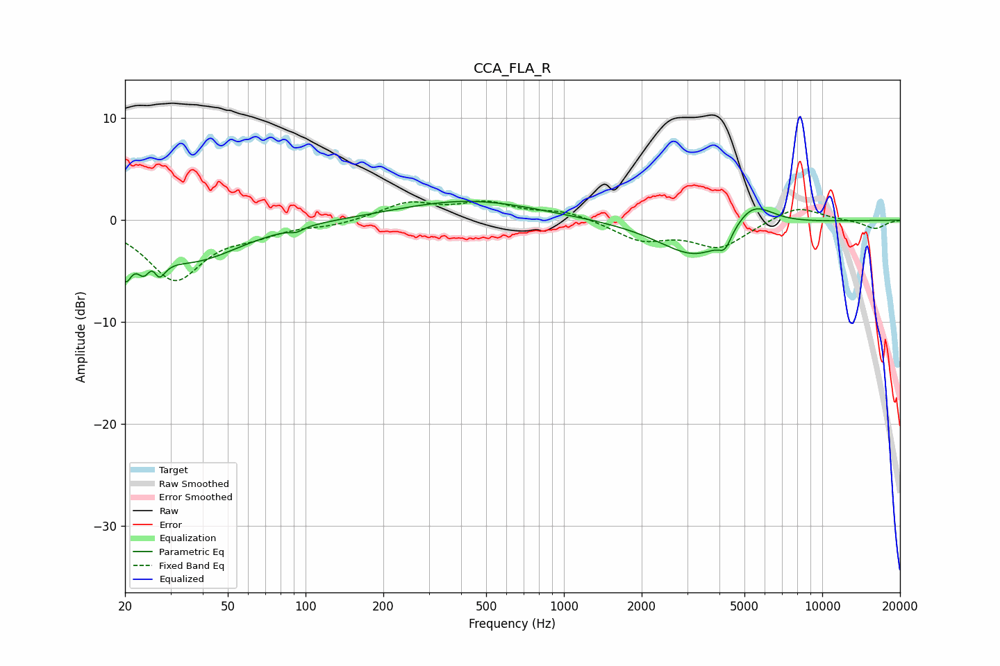

# CCA_FLA_R
See [usage instructions](https://github.com/jaakkopasanen/AutoEq#usage) for more options and info.

### Parametric EQs
Apply preamp of -1.9 dB when using parametric equalizer.

|   # | Type    |   Fc (Hz) |    Q |   Gain (dB) |
|-----|---------|-----------|------|-------------|
|   1 | Peaking |        20 | 5.68 |        -3.5 |
|   2 | Peaking |        24 | 5.94 |        -1.8 |
|   3 | Peaking |        26 | 5.97 |         2.9 |
|   4 | Peaking |        27 | 5.59 |        -4.1 |
|   5 | Peaking |        36 | 0.75 |        -3.9 |
|   6 | Peaking |        92 | 5.99 |        -0.4 |
|   7 | Peaking |       426 | 0.53 |         2   |
|   8 | Peaking |      3326 | 0.95 |        -3.9 |
|   9 | Peaking |      4202 | 5.89 |        -1.4 |
|  10 | Peaking |      5331 | 1.69 |         3   |

### Fixed Band EQs
When using fixed band (also called graphic) equalizer, apply preamp of **-2.0 dB** (if available) and set gains manually with these parameters.

|   # | Type    |   Fc (Hz) |    Q |   Gain (dB) |
|-----|---------|-----------|------|-------------|
|   1 | Peaking |        31 | 1.41 |        -5.7 |
|   2 | Peaking |        62 | 1.41 |        -1   |
|   3 | Peaking |       125 | 1.41 |        -0.5 |
|   4 | Peaking |       250 | 1.41 |         1.6 |
|   5 | Peaking |       500 | 1.41 |         1.5 |
|   6 | Peaking |      1000 | 1.41 |         0.9 |
|   7 | Peaking |      2000 | 1.41 |        -1.9 |
|   8 | Peaking |      4000 | 1.41 |        -2.6 |
|   9 | Peaking |      8000 | 1.41 |         1.5 |
|  10 | Peaking |     16000 | 1.41 |        -0.9 |

### Graphs

