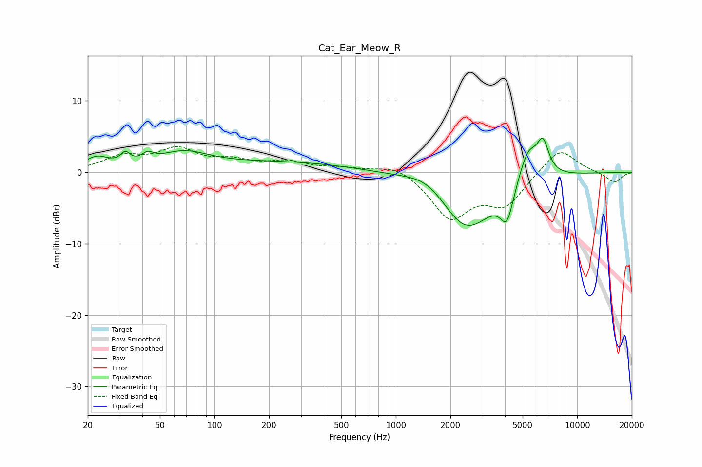

# Cat_Ear_Meow_R
See [usage instructions](https://github.com/jaakkopasanen/AutoEq#usage) for more options and info.

### Parametric EQs
Apply preamp of -4.8 dB when using parametric equalizer.

|   # | Type    |   Fc (Hz) |    Q |   Gain (dB) |
|-----|---------|-----------|------|-------------|
|   1 | Peaking |        22 | 2.12 |         1.8 |
|   2 | Peaking |        32 | 5.57 |         1.5 |
|   3 | Peaking |        43 | 4.37 |         1.1 |
|   4 | Peaking |        67 | 1.01 |         2.3 |
|   5 | Peaking |       249 | 0.35 |         1.4 |
|   6 | Peaking |      1545 | 1.08 |         2.8 |
|   7 | Peaking |      2409 | 0.87 |        -8.9 |
|   8 | Peaking |      4099 | 3.9  |        -4.5 |
|   9 | Peaking |      5362 | 2.52 |         4.8 |
|  10 | Peaking |      6475 | 4.19 |         4.3 |

### Fixed Band EQs
When using fixed band (also called graphic) equalizer, apply preamp of **-3.7 dB** (if available) and set gains manually with these parameters.

|   # | Type    |   Fc (Hz) |    Q |   Gain (dB) |
|-----|---------|-----------|------|-------------|
|   1 | Peaking |        31 | 1.41 |         2   |
|   2 | Peaking |        62 | 1.41 |         2.9 |
|   3 | Peaking |       125 | 1.41 |         1.3 |
|   4 | Peaking |       250 | 1.41 |         1.3 |
|   5 | Peaking |       500 | 1.41 |         0.5 |
|   6 | Peaking |      1000 | 1.41 |         1.3 |
|   7 | Peaking |      2000 | 1.41 |        -6.2 |
|   8 | Peaking |      4000 | 1.41 |        -4.3 |
|   9 | Peaking |      8000 | 1.41 |         3.6 |
|  10 | Peaking |     16000 | 1.41 |        -1.5 |

### Graphs

