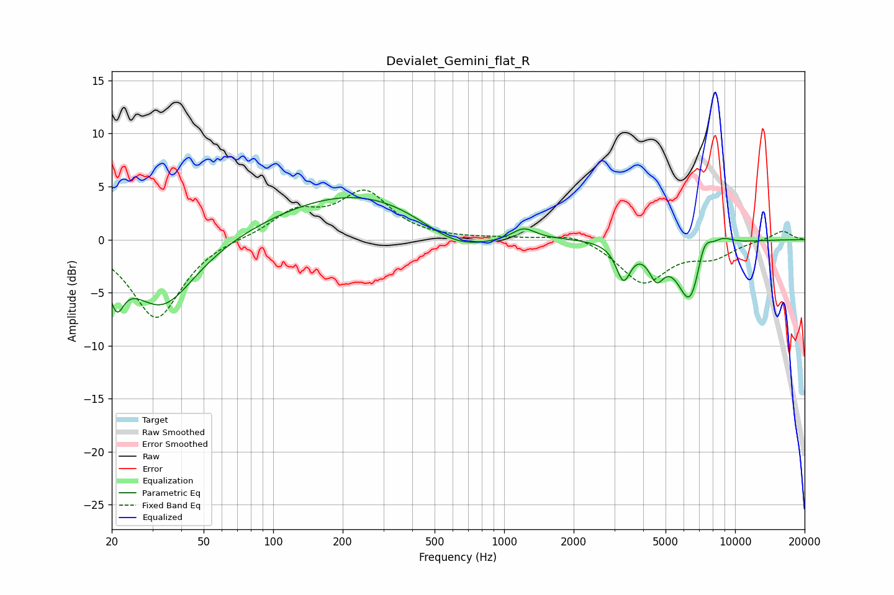

# Devialet_Gemini_flat_R
See [usage instructions](https://github.com/jaakkopasanen/AutoEq#usage) for more options and info.

### Parametric EQs
Apply preamp of -4.1 dB when using parametric equalizer.

|   # | Type    |   Fc (Hz) |    Q |   Gain (dB) |
|-----|---------|-----------|------|-------------|
|   1 | Peaking |        21 | 4.57 |        -3.6 |
|   2 | Peaking |        33 | 0.98 |        -6.5 |
|   3 | Peaking |       270 | 0.34 |         5   |
|   4 | Peaking |       622 | 0.79 |        -3.5 |
|   5 | Peaking |      1215 | 2.98 |         1   |
|   6 | Peaking |      3285 | 4.55 |        -3.3 |
|   7 | Peaking |      4567 | 4.3  |        -2.6 |
|   8 | Peaking |      6418 | 2.48 |        -6.4 |
|   9 | Peaking |      7310 | 3.88 |         2.9 |
|  10 | Peaking |      8793 | 2.72 |         0.8 |

### Fixed Band EQs
When using fixed band (also called graphic) equalizer, apply preamp of **-4.8 dB** (if available) and set gains manually with these parameters.

|   # | Type    |   Fc (Hz) |    Q |   Gain (dB) |
|-----|---------|-----------|------|-------------|
|   1 | Peaking |        31 | 1.41 |        -7.5 |
|   2 | Peaking |        62 | 1.41 |         0.2 |
|   3 | Peaking |       125 | 1.41 |         2.5 |
|   4 | Peaking |       250 | 1.41 |         4.3 |
|   5 | Peaking |       500 | 1.41 |        -0   |
|   6 | Peaking |      1000 | 1.41 |         0.1 |
|   7 | Peaking |      2000 | 1.41 |         0.8 |
|   8 | Peaking |      4000 | 1.41 |        -4   |
|   9 | Peaking |      8000 | 1.41 |        -1.4 |
|  10 | Peaking |     16000 | 1.41 |         0.9 |

### Graphs

