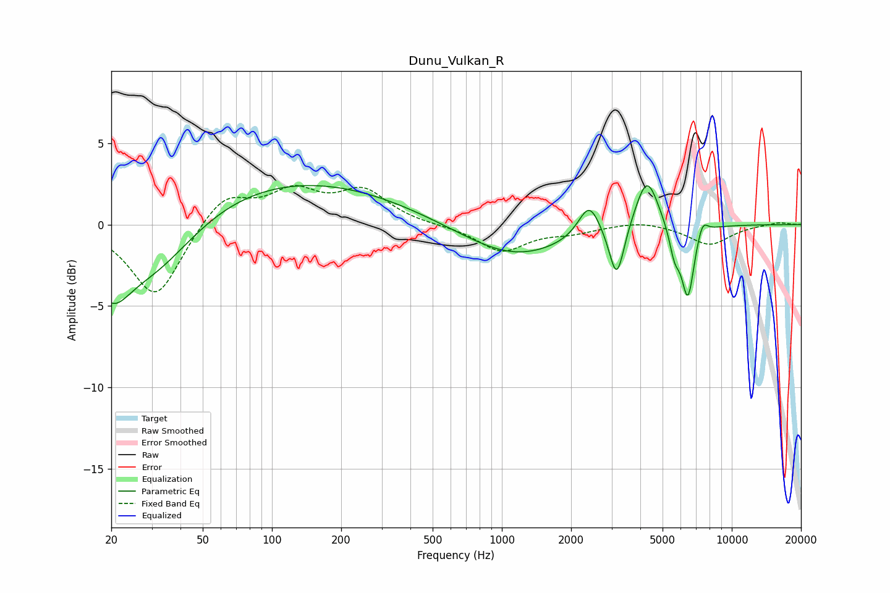

# Dunu_Vulkan_R
See [usage instructions](https://github.com/jaakkopasanen/AutoEq#usage) for more options and info.

### Parametric EQs
Apply preamp of -2.5 dB when using parametric equalizer.

|   # | Type    |   Fc (Hz) |    Q |   Gain (dB) |
|-----|---------|-----------|------|-------------|
|   1 | Peaking |        20 | 1.76 |        -3.2 |
|   2 | Peaking |        30 | 0.77 |        -3.4 |
|   3 | Peaking |       120 | 0.29 |         2.8 |
|   4 | Peaking |      1140 | 0.62 |        -2.1 |
|   5 | Peaking |      2396 | 3.05 |         2.1 |
|   6 | Peaking |      3159 | 4.39 |        -3.4 |
|   7 | Peaking |      4276 | 2.79 |         3.3 |
|   8 | Peaking |      5641 | 5.97 |        -1.7 |
|   9 | Peaking |      6442 | 4.96 |        -4.4 |
|  10 | Peaking |      7452 | 5.91 |         0.9 |

### Fixed Band EQs
When using fixed band (also called graphic) equalizer, apply preamp of **-2.5 dB** (if available) and set gains manually with these parameters.

|   # | Type    |   Fc (Hz) |    Q |   Gain (dB) |
|-----|---------|-----------|------|-------------|
|   1 | Peaking |        31 | 1.41 |        -4.6 |
|   2 | Peaking |        62 | 1.41 |         1.9 |
|   3 | Peaking |       125 | 1.41 |         1.9 |
|   4 | Peaking |       250 | 1.41 |         2   |
|   5 | Peaking |       500 | 1.41 |        -0   |
|   6 | Peaking |      1000 | 1.41 |        -1.6 |
|   7 | Peaking |      2000 | 1.41 |        -0.4 |
|   8 | Peaking |      4000 | 1.41 |         0.3 |
|   9 | Peaking |      8000 | 1.41 |        -1.2 |
|  10 | Peaking |     16000 | 1.41 |         0.2 |

### Graphs

