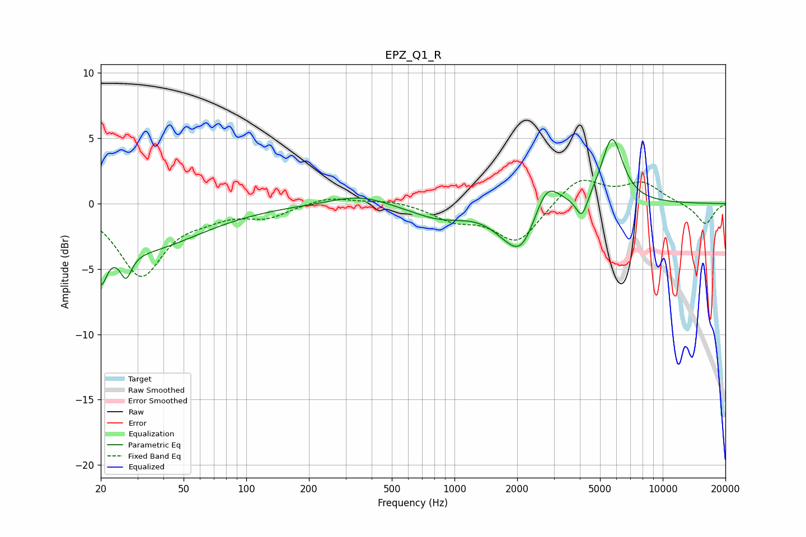

# EPZ_Q1_R
See [usage instructions](https://github.com/jaakkopasanen/AutoEq#usage) for more options and info.

### Parametric EQs
Apply preamp of -5.0 dB when using parametric equalizer.

|   # | Type    |   Fc (Hz) |    Q |   Gain (dB) |
|-----|---------|-----------|------|-------------|
|   1 | Peaking |        20 | 5    |        -3   |
|   2 | Peaking |        26 | 5.21 |        -1.9 |
|   3 | Peaking |        30 | 0.49 |        -3.5 |
|   4 | Peaking |       351 | 1.06 |         0.8 |
|   5 | Peaking |       850 | 1    |        -1.1 |
|   6 | Peaking |      1708 | 1.76 |        -0.8 |
|   7 | Peaking |      2097 | 1.91 |        -3.3 |
|   8 | Peaking |      2767 | 2.38 |         2.4 |
|   9 | Peaking |      4091 | 4.96 |        -1.8 |
|  10 | Peaking |      5711 | 2.72 |         5.1 |

### Fixed Band EQs
When using fixed band (also called graphic) equalizer, apply preamp of **-1.9 dB** (if available) and set gains manually with these parameters.

|   # | Type    |   Fc (Hz) |    Q |   Gain (dB) |
|-----|---------|-----------|------|-------------|
|   1 | Peaking |        31 | 1.41 |        -5.4 |
|   2 | Peaking |        62 | 1.41 |        -0.7 |
|   3 | Peaking |       125 | 1.41 |        -0.9 |
|   4 | Peaking |       250 | 1.41 |         0.6 |
|   5 | Peaking |       500 | 1.41 |         0.3 |
|   6 | Peaking |      1000 | 1.41 |        -1.1 |
|   7 | Peaking |      2000 | 1.41 |        -3   |
|   8 | Peaking |      4000 | 1.41 |         2.1 |
|   9 | Peaking |      8000 | 1.41 |         1.5 |
|  10 | Peaking |     16000 | 1.41 |        -1.6 |

### Graphs

