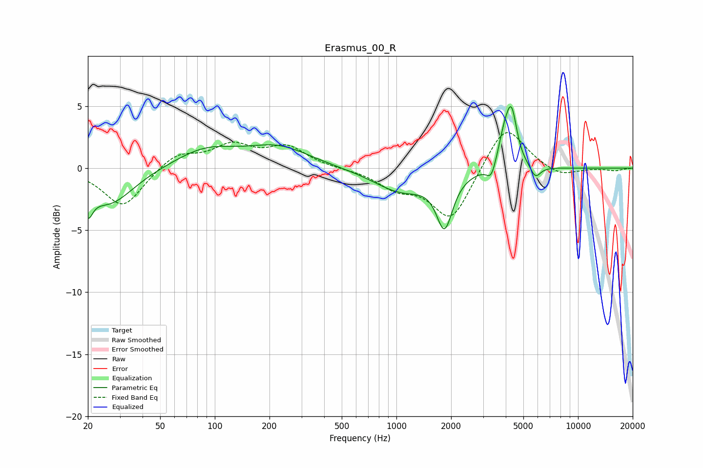

# Erasmus_00_R
See [usage instructions](https://github.com/jaakkopasanen/AutoEq#usage) for more options and info.

### Parametric EQs
Apply preamp of -5.0 dB when using parametric equalizer.

|   # | Type    |   Fc (Hz) |    Q |   Gain (dB) |
|-----|---------|-----------|------|-------------|
|   1 | Peaking |        20 | 5.54 |        -2   |
|   2 | Peaking |        26 | 1.05 |        -2.9 |
|   3 | Peaking |        89 | 0.82 |         1.5 |
|   4 | Peaking |       226 | 0.82 |         1.6 |
|   5 | Peaking |      1061 | 0.93 |        -1.8 |
|   6 | Peaking |      1840 | 3.24 |        -4.1 |
|   7 | Peaking |      3331 | 5.42 |        -1.2 |
|   8 | Peaking |      3931 | 4.04 |         2.2 |
|   9 | Peaking |      4309 | 4.71 |         4   |
|  10 | Peaking |      5830 | 4.95 |        -1   |

### Fixed Band EQs
When using fixed band (also called graphic) equalizer, apply preamp of **-3.0 dB** (if available) and set gains manually with these parameters.

|   # | Type    |   Fc (Hz) |    Q |   Gain (dB) |
|-----|---------|-----------|------|-------------|
|   1 | Peaking |        31 | 1.41 |        -3.2 |
|   2 | Peaking |        62 | 1.41 |         1.2 |
|   3 | Peaking |       125 | 1.41 |         1.7 |
|   4 | Peaking |       250 | 1.41 |         1.6 |
|   5 | Peaking |       500 | 1.41 |        -0   |
|   6 | Peaking |      1000 | 1.41 |        -1.4 |
|   7 | Peaking |      2000 | 1.41 |        -4.2 |
|   8 | Peaking |      4000 | 1.41 |         3.7 |
|   9 | Peaking |      8000 | 1.41 |        -0.7 |
|  10 | Peaking |     16000 | 1.41 |        -0.2 |

### Graphs

