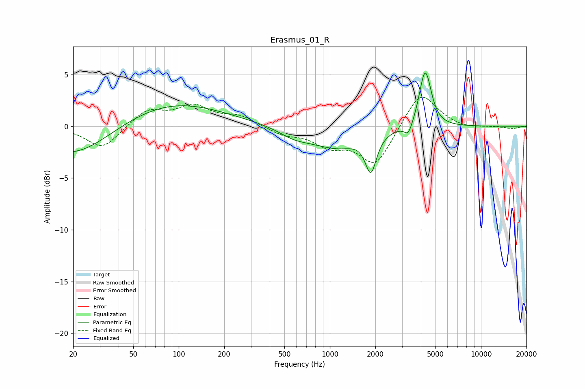

# Erasmus_01_R
See [usage instructions](https://github.com/jaakkopasanen/AutoEq#usage) for more options and info.

### Parametric EQs
Apply preamp of -5.3 dB when using parametric equalizer.

|   # | Type    |   Fc (Hz) |    Q |   Gain (dB) |
|-----|---------|-----------|------|-------------|
|   1 | Peaking |        20 | 0.59 |        -3   |
|   2 | Peaking |        90 | 0.42 |         2.4 |
|   3 | Peaking |       584 | 1.36 |        -0.9 |
|   4 | Peaking |       803 | 1.85 |        -0.2 |
|   5 | Peaking |      1140 | 1    |        -1.8 |
|   6 | Peaking |      1869 | 3.8  |        -3.9 |
|   7 | Peaking |      1903 | 3.36 |         0.3 |
|   8 | Peaking |      3312 | 5.2  |        -1.2 |
|   9 | Peaking |      4219 | 3.89 |         3.2 |
|  10 | Peaking |      4359 | 3.72 |         2.4 |

### Fixed Band EQs
When using fixed band (also called graphic) equalizer, apply preamp of **-2.9 dB** (if available) and set gains manually with these parameters.

|   # | Type    |   Fc (Hz) |    Q |   Gain (dB) |
|-----|---------|-----------|------|-------------|
|   1 | Peaking |        31 | 1.41 |        -2.2 |
|   2 | Peaking |        62 | 1.41 |         1.6 |
|   3 | Peaking |       125 | 1.41 |         1.8 |
|   4 | Peaking |       250 | 1.41 |         0.9 |
|   5 | Peaking |       500 | 1.41 |        -0.7 |
|   6 | Peaking |      1000 | 1.41 |        -1.6 |
|   7 | Peaking |      2000 | 1.41 |        -3.7 |
|   8 | Peaking |      4000 | 1.41 |         3.5 |
|   9 | Peaking |      8000 | 1.41 |        -0.3 |
|  10 | Peaking |     16000 | 1.41 |        -0.2 |

### Graphs

