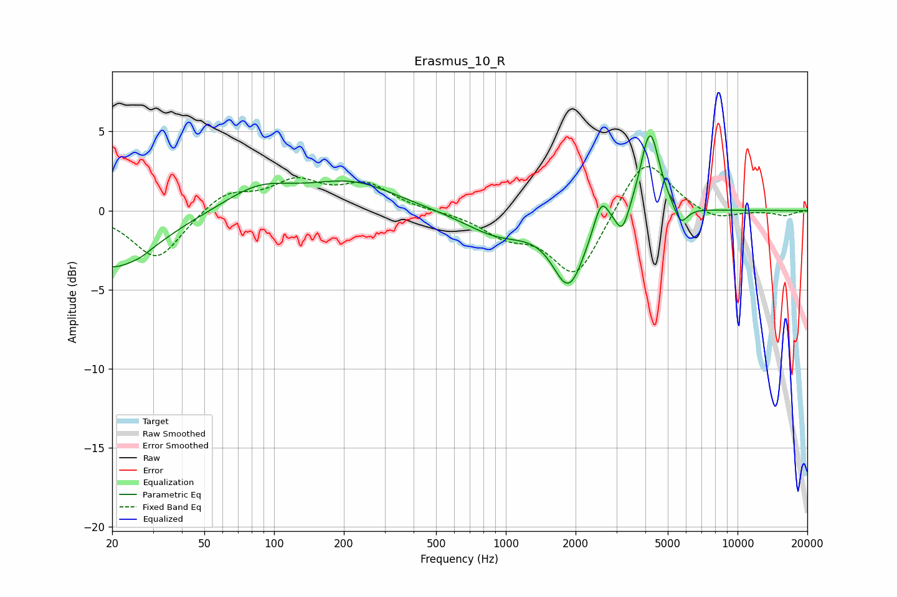

# Erasmus_10_R
See [usage instructions](https://github.com/jaakkopasanen/AutoEq#usage) for more options and info.

### Parametric EQs
Apply preamp of -4.8 dB when using parametric equalizer.

|   # | Type    |   Fc (Hz) |    Q |   Gain (dB) |
|-----|---------|-----------|------|-------------|
|   1 | Peaking |        20 | 0.77 |        -3.7 |
|   2 | Peaking |        27 | 4.55 |        -0.1 |
|   3 | Peaking |        86 | 0.94 |         1.5 |
|   4 | Peaking |       218 | 0.75 |         1.7 |
|   5 | Peaking |       925 | 0.95 |        -1.5 |
|   6 | Peaking |      1872 | 2.03 |        -4.4 |
|   7 | Peaking |      2582 | 4.48 |         1.9 |
|   8 | Peaking |      3184 | 4.96 |        -1.6 |
|   9 | Peaking |      4189 | 3.46 |         5.3 |
|  10 | Peaking |      5685 | 4.65 |        -1.3 |

### Fixed Band EQs
When using fixed band (also called graphic) equalizer, apply preamp of **-2.9 dB** (if available) and set gains manually with these parameters.

|   # | Type    |   Fc (Hz) |    Q |   Gain (dB) |
|-----|---------|-----------|------|-------------|
|   1 | Peaking |        31 | 1.41 |        -3.1 |
|   2 | Peaking |        62 | 1.41 |         1.2 |
|   3 | Peaking |       125 | 1.41 |         1.7 |
|   4 | Peaking |       250 | 1.41 |         1.5 |
|   5 | Peaking |       500 | 1.41 |        -0   |
|   6 | Peaking |      1000 | 1.41 |        -1.3 |
|   7 | Peaking |      2000 | 1.41 |        -4.2 |
|   8 | Peaking |      4000 | 1.41 |         3.6 |
|   9 | Peaking |      8000 | 1.41 |        -0.7 |
|  10 | Peaking |     16000 | 1.41 |        -0.3 |

### Graphs

