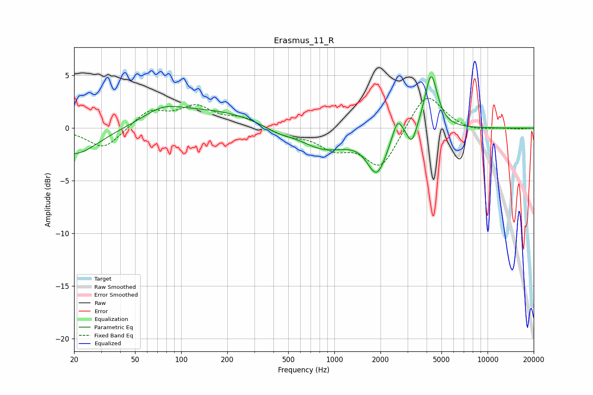

# Erasmus_11_R
See [usage instructions](https://github.com/jaakkopasanen/AutoEq#usage) for more options and info.

### Parametric EQs
Apply preamp of -5.0 dB when using parametric equalizer.

|   # | Type    |   Fc (Hz) |    Q |   Gain (dB) |
|-----|---------|-----------|------|-------------|
|   1 | Peaking |        20 | 0.91 |        -2.6 |
|   2 | Peaking |        76 | 1.13 |         1.2 |
|   3 | Peaking |       159 | 0.45 |         1.6 |
|   4 | Peaking |       418 | 1.57 |        -0.5 |
|   5 | Peaking |       861 | 0.87 |        -2   |
|   6 | Peaking |      1896 | 2.2  |        -3.9 |
|   7 | Peaking |      2587 | 4.24 |         1.9 |
|   8 | Peaking |      3206 | 4.52 |        -2   |
|   9 | Peaking |      3217 | 3.35 |         0.3 |
|  10 | Peaking |      4279 | 3.43 |         5.3 |

### Fixed Band EQs
When using fixed band (also called graphic) equalizer, apply preamp of **-2.9 dB** (if available) and set gains manually with these parameters.

|   # | Type    |   Fc (Hz) |    Q |   Gain (dB) |
|-----|---------|-----------|------|-------------|
|   1 | Peaking |        31 | 1.41 |        -2   |
|   2 | Peaking |        62 | 1.41 |         1.6 |
|   3 | Peaking |       125 | 1.41 |         1.9 |
|   4 | Peaking |       250 | 1.41 |         0.9 |
|   5 | Peaking |       500 | 1.41 |        -0.7 |
|   6 | Peaking |      1000 | 1.41 |        -1.7 |
|   7 | Peaking |      2000 | 1.41 |        -3.8 |
|   8 | Peaking |      4000 | 1.41 |         3.6 |
|   9 | Peaking |      8000 | 1.41 |        -0.3 |
|  10 | Peaking |     16000 | 1.41 |        -0.1 |

### Graphs

