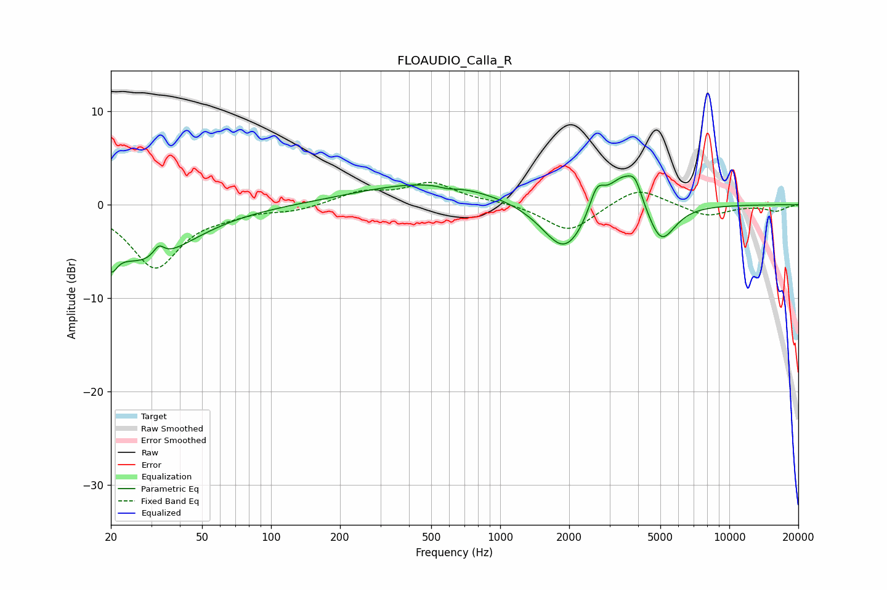

# FLOAUDIO_Calla_R
See [usage instructions](https://github.com/jaakkopasanen/AutoEq#usage) for more options and info.

### Parametric EQs
Apply preamp of -3.2 dB when using parametric equalizer.

|   # | Type    |   Fc (Hz) |    Q |   Gain (dB) |
|-----|---------|-----------|------|-------------|
|   1 | Peaking |        20 | 5.65 |        -2.4 |
|   2 | Peaking |        28 | 0.7  |        -6   |
|   3 | Peaking |        32 | 6    |         1.3 |
|   4 | Peaking |       485 | 0.47 |         2.4 |
|   5 | Peaking |       591 | 4.13 |        -0.3 |
|   6 | Peaking |      1915 | 1.45 |        -5.6 |
|   7 | Peaking |      2638 | 4.35 |         2.7 |
|   8 | Peaking |      3471 | 1.82 |         4.2 |
|   9 | Peaking |      3887 | 5.2  |         1.5 |
|  10 | Peaking |      5025 | 2.26 |        -4.6 |

### Fixed Band EQs
When using fixed band (also called graphic) equalizer, apply preamp of **-2.5 dB** (if available) and set gains manually with these parameters.

|   # | Type    |   Fc (Hz) |    Q |   Gain (dB) |
|-----|---------|-----------|------|-------------|
|   1 | Peaking |        31 | 1.41 |        -6.7 |
|   2 | Peaking |        62 | 1.41 |        -0.7 |
|   3 | Peaking |       125 | 1.41 |        -0.6 |
|   4 | Peaking |       250 | 1.41 |         1.3 |
|   5 | Peaking |       500 | 1.41 |         2.2 |
|   6 | Peaking |      1000 | 1.41 |         0.3 |
|   7 | Peaking |      2000 | 1.41 |        -3   |
|   8 | Peaking |      4000 | 1.41 |         2   |
|   9 | Peaking |      8000 | 1.41 |        -1.3 |
|  10 | Peaking |     16000 | 1.41 |        -0.7 |

### Graphs

