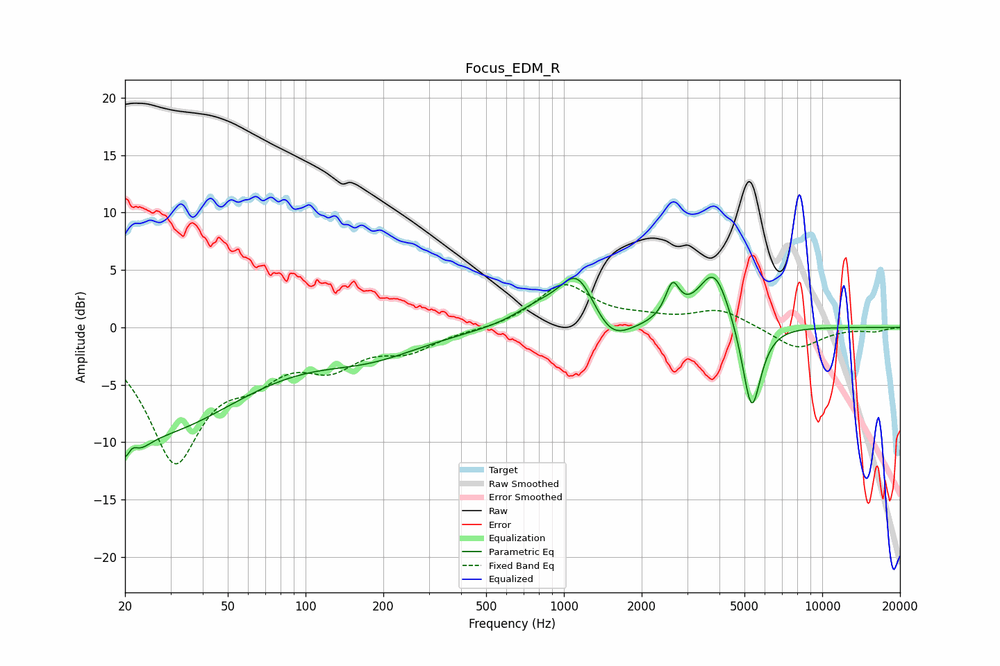

# Focus_EDM_R
See [usage instructions](https://github.com/jaakkopasanen/AutoEq#usage) for more options and info.

### Parametric EQs
Apply preamp of -4.5 dB when using parametric equalizer.

|   # | Type    |   Fc (Hz) |    Q |   Gain (dB) |
|-----|---------|-----------|------|-------------|
|   1 | Peaking |        21 | 3.21 |        -6.5 |
|   2 | Peaking |        21 | 5.26 |         3.6 |
|   3 | Peaking |        28 | 0.44 |        -8.4 |
|   4 | Peaking |       178 | 0.69 |        -2.1 |
|   5 | Peaking |       785 | 1.49 |         1.3 |
|   6 | Peaking |      1129 | 1.97 |         4.6 |
|   7 | Peaking |      1516 | 1.87 |        -2.3 |
|   8 | Peaking |      2631 | 5.23 |         2.9 |
|   9 | Peaking |      3817 | 2.21 |         5.2 |
|  10 | Peaking |      5328 | 3.74 |        -8.1 |

### Fixed Band EQs
When using fixed band (also called graphic) equalizer, apply preamp of **-3.8 dB** (if available) and set gains manually with these parameters.

|   # | Type    |   Fc (Hz) |    Q |   Gain (dB) |
|-----|---------|-----------|------|-------------|
|   1 | Peaking |        31 | 1.41 |       -11.2 |
|   2 | Peaking |        62 | 1.41 |        -2.9 |
|   3 | Peaking |       125 | 1.41 |        -2.8 |
|   4 | Peaking |       250 | 1.41 |        -1.8 |
|   5 | Peaking |       500 | 1.41 |        -0.2 |
|   6 | Peaking |      1000 | 1.41 |         3.7 |
|   7 | Peaking |      2000 | 1.41 |         0.6 |
|   8 | Peaking |      4000 | 1.41 |         1.5 |
|   9 | Peaking |      8000 | 1.41 |        -1.9 |
|  10 | Peaking |     16000 | 1.41 |        -0.3 |

### Graphs

