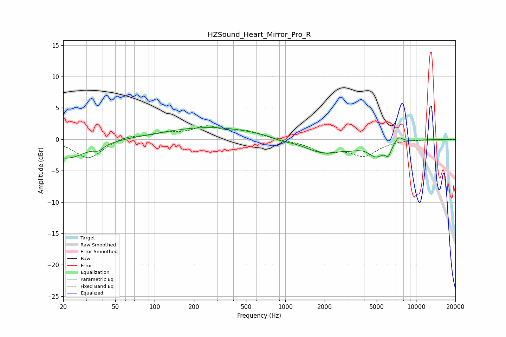

# HZSound_Heart_Mirror_Pro_R
See [usage instructions](https://github.com/jaakkopasanen/AutoEq#usage) for more options and info.

### Parametric EQs
Apply preamp of -2.0 dB when using parametric equalizer.

|   # | Type    |   Fc (Hz) |    Q |   Gain (dB) |
|-----|---------|-----------|------|-------------|
|   1 | Peaking |        21 | 0.93 |        -3.1 |
|   2 | Peaking |        37 | 4.2  |        -0.7 |
|   3 | Peaking |       267 | 0.38 |         1.9 |
|   4 | Peaking |       941 | 2.28 |        -0.4 |
|   5 | Peaking |      1936 | 0.98 |        -2.2 |
|   6 | Peaking |      3165 | 2.05 |        -0.5 |
|   7 | Peaking |      4871 | 2.19 |         0.1 |
|   8 | Peaking |      4964 | 2.24 |        -2.3 |
|   9 | Peaking |      6134 | 5.98 |        -1.6 |
|  10 | Peaking |      7355 | 4.6  |         1   |

### Fixed Band EQs
When using fixed band (also called graphic) equalizer, apply preamp of **-2.3 dB** (if available) and set gains manually with these parameters.

|   # | Type    |   Fc (Hz) |    Q |   Gain (dB) |
|-----|---------|-----------|------|-------------|
|   1 | Peaking |        31 | 1.41 |        -3.1 |
|   2 | Peaking |        62 | 1.41 |         0.7 |
|   3 | Peaking |       125 | 1.41 |         0.8 |
|   4 | Peaking |       250 | 1.41 |         1.8 |
|   5 | Peaking |       500 | 1.41 |         1.2 |
|   6 | Peaking |      1000 | 1.41 |        -0.2 |
|   7 | Peaking |      2000 | 1.41 |        -1.8 |
|   8 | Peaking |      4000 | 1.41 |        -2.4 |
|   9 | Peaking |      8000 | 1.41 |         0   |
|  10 | Peaking |     16000 | 1.41 |        -0.1 |

### Graphs

