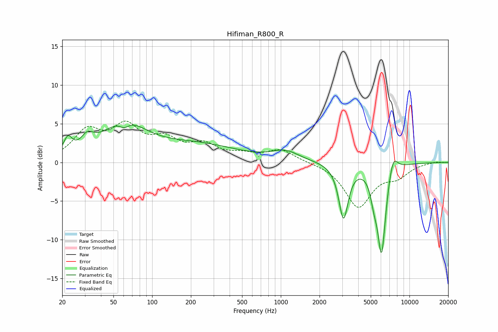

# Hifiman_R800_R
See [usage instructions](https://github.com/jaakkopasanen/AutoEq#usage) for more options and info.

### Parametric EQs
Apply preamp of -4.9 dB when using parametric equalizer.

|   # | Type    |   Fc (Hz) |    Q |   Gain (dB) |
|-----|---------|-----------|------|-------------|
|   1 | Peaking |        22 | 4.37 |         2   |
|   2 | Peaking |        31 | 3.01 |         1.6 |
|   3 | Peaking |        60 | 0.82 |         4.7 |
|   4 | Peaking |        61 | 3.68 |        -0.9 |
|   5 | Peaking |       229 | 0.46 |         2.1 |
|   6 | Peaking |      1085 | 1.36 |         1.3 |
|   7 | Peaking |      3071 | 3.88 |        -7   |
|   8 | Peaking |      5292 | 5.55 |        -2   |
|   9 | Peaking |      6067 | 4.11 |       -11.6 |
|  10 | Peaking |      7450 | 3.76 |         2.6 |

### Fixed Band EQs
When using fixed band (also called graphic) equalizer, apply preamp of **-5.4 dB** (if available) and set gains manually with these parameters.

|   # | Type    |   Fc (Hz) |    Q |   Gain (dB) |
|-----|---------|-----------|------|-------------|
|   1 | Peaking |        31 | 1.41 |         3.7 |
|   2 | Peaking |        62 | 1.41 |         4.1 |
|   3 | Peaking |       125 | 1.41 |         2.4 |
|   4 | Peaking |       250 | 1.41 |         2   |
|   5 | Peaking |       500 | 1.41 |         0.8 |
|   6 | Peaking |      1000 | 1.41 |         1.6 |
|   7 | Peaking |      2000 | 1.41 |         0   |
|   8 | Peaking |      4000 | 1.41 |        -5.7 |
|   9 | Peaking |      8000 | 1.41 |        -1.5 |
|  10 | Peaking |     16000 | 1.41 |         0.1 |

### Graphs

