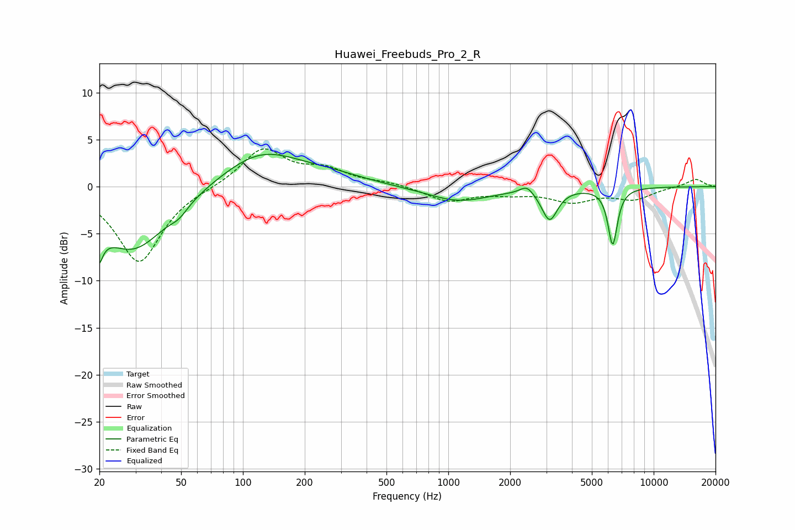

# Huawei_Freebuds_Pro_2_R
See [usage instructions](https://github.com/jaakkopasanen/AutoEq#usage) for more options and info.

### Parametric EQs
Apply preamp of -3.5 dB when using parametric equalizer.

|   # | Type    |   Fc (Hz) |    Q |   Gain (dB) |
|-----|---------|-----------|------|-------------|
|   1 | Peaking |        20 | 5.64 |        -6.8 |
|   2 | Peaking |        20 | 5.93 |         3.2 |
|   3 | Peaking |        29 | 0.84 |        -6.8 |
|   4 | Peaking |        49 | 3.28 |        -0.8 |
|   5 | Peaking |       122 | 0.74 |         3.7 |
|   6 | Peaking |       266 | 0.82 |         0.8 |
|   7 | Peaking |      1119 | 0.93 |        -1.6 |
|   8 | Peaking |      2417 | 4.26 |         0.9 |
|   9 | Peaking |      3115 | 3.71 |        -3.4 |
|  10 | Peaking |      6315 | 6    |        -6   |

### Fixed Band EQs
When using fixed band (also called graphic) equalizer, apply preamp of **-4.1 dB** (if available) and set gains manually with these parameters.

|   # | Type    |   Fc (Hz) |    Q |   Gain (dB) |
|-----|---------|-----------|------|-------------|
|   1 | Peaking |        31 | 1.41 |        -8.1 |
|   2 | Peaking |        62 | 1.41 |        -0   |
|   3 | Peaking |       125 | 1.41 |         4   |
|   4 | Peaking |       250 | 1.41 |         1.6 |
|   5 | Peaking |       500 | 1.41 |         0.4 |
|   6 | Peaking |      1000 | 1.41 |        -1.5 |
|   7 | Peaking |      2000 | 1.41 |        -0.6 |
|   8 | Peaking |      4000 | 1.41 |        -1.5 |
|   9 | Peaking |      8000 | 1.41 |        -1.2 |
|  10 | Peaking |     16000 | 1.41 |         0.8 |

### Graphs

