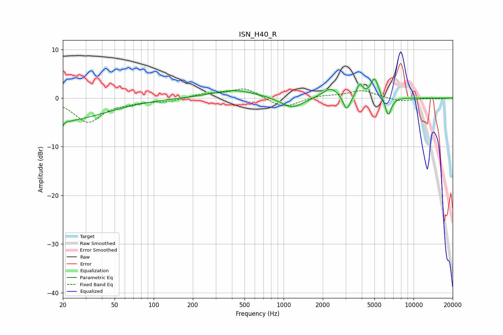

# ISN_H40_R
See [usage instructions](https://github.com/jaakkopasanen/AutoEq#usage) for more options and info.

### Parametric EQs
Apply preamp of -4.0 dB when using parametric equalizer.

|   # | Type    |   Fc (Hz) |    Q |   Gain (dB) |
|-----|---------|-----------|------|-------------|
|   1 | Peaking |        20 | 5.22 |        -3.2 |
|   2 | Peaking |        20 | 0.43 |        -4.5 |
|   3 | Peaking |        20 | 5.98 |         2.3 |
|   4 | Peaking |       419 | 0.84 |         1.7 |
|   5 | Peaking |      1163 | 1.66 |        -2.2 |
|   6 | Peaking |      2301 | 2.25 |         2.2 |
|   7 | Peaking |      3057 | 5.32 |        -3.2 |
|   8 | Peaking |      3848 | 6    |         2.6 |
|   9 | Peaking |      5016 | 4.52 |         4.1 |
|  10 | Peaking |      6371 | 5.53 |        -4   |

### Fixed Band EQs
When using fixed band (also called graphic) equalizer, apply preamp of **-1.9 dB** (if available) and set gains manually with these parameters.

|   # | Type    |   Fc (Hz) |    Q |   Gain (dB) |
|-----|---------|-----------|------|-------------|
|   1 | Peaking |        31 | 1.41 |        -4.9 |
|   2 | Peaking |        62 | 1.41 |        -0.6 |
|   3 | Peaking |       125 | 1.41 |        -0.7 |
|   4 | Peaking |       250 | 1.41 |         0.9 |
|   5 | Peaking |       500 | 1.41 |         2.1 |
|   6 | Peaking |      1000 | 1.41 |        -2.1 |
|   7 | Peaking |      2000 | 1.41 |         0.5 |
|   8 | Peaking |      4000 | 1.41 |         1.6 |
|   9 | Peaking |      8000 | 1.41 |        -0.7 |
|  10 | Peaking |     16000 | 1.41 |        -0.1 |

### Graphs

