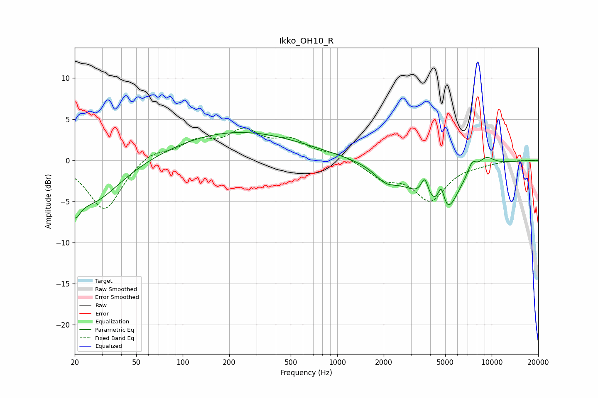

# Ikko_OH10_R
See [usage instructions](https://github.com/jaakkopasanen/AutoEq#usage) for more options and info.

### Parametric EQs
Apply preamp of -3.5 dB when using parametric equalizer.

|   # | Type    |   Fc (Hz) |    Q |   Gain (dB) |
|-----|---------|-----------|------|-------------|
|   1 | Peaking |        20 | 4.26 |        -2.7 |
|   2 | Peaking |        25 | 0.77 |        -5.2 |
|   3 | Peaking |       225 | 0.33 |         3.5 |
|   4 | Peaking |      2058 | 1.94 |        -1.5 |
|   5 | Peaking |      3627 | 0.88 |        -3   |
|   6 | Peaking |      3685 | 6    |         2.3 |
|   7 | Peaking |      4715 | 5.92 |         3.2 |
|   8 | Peaking |      5013 | 1.85 |        -5   |
|   9 | Peaking |      7466 | 4.95 |         1.4 |
|  10 | Peaking |      9217 | 2.56 |         1.2 |

### Fixed Band EQs
When using fixed band (also called graphic) equalizer, apply preamp of **-4.0 dB** (if available) and set gains manually with these parameters.

|   # | Type    |   Fc (Hz) |    Q |   Gain (dB) |
|-----|---------|-----------|------|-------------|
|   1 | Peaking |        31 | 1.41 |        -6.2 |
|   2 | Peaking |        62 | 1.41 |         1.2 |
|   3 | Peaking |       125 | 1.41 |         2   |
|   4 | Peaking |       250 | 1.41 |         3.2 |
|   5 | Peaking |       500 | 1.41 |         2.1 |
|   6 | Peaking |      1000 | 1.41 |         0.8 |
|   7 | Peaking |      2000 | 1.41 |        -2   |
|   8 | Peaking |      4000 | 1.41 |        -4.6 |
|   9 | Peaking |      8000 | 1.41 |        -0.3 |
|  10 | Peaking |     16000 | 1.41 |         0   |

### Graphs

