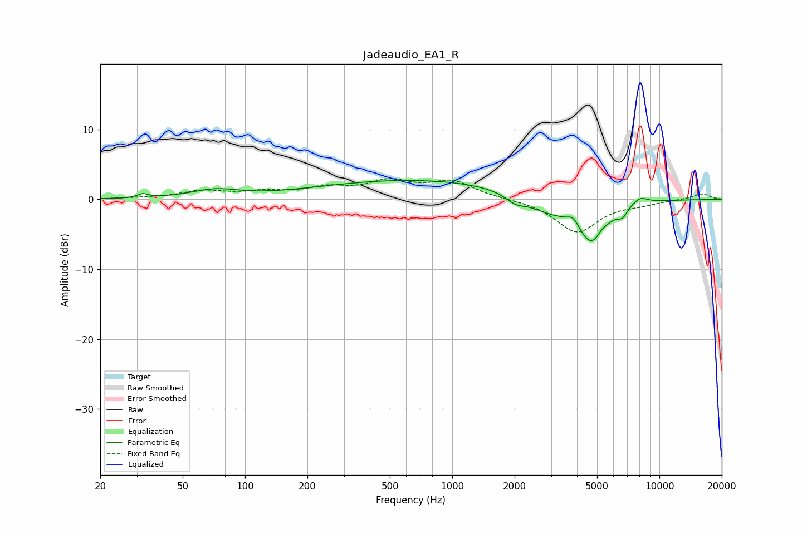

# Jadeaudio_EA1_R
See [usage instructions](https://github.com/jaakkopasanen/AutoEq#usage) for more options and info.

### Parametric EQs
Apply preamp of -2.8 dB when using parametric equalizer.

|   # | Type    |   Fc (Hz) |    Q |   Gain (dB) |
|-----|---------|-----------|------|-------------|
|   1 | Peaking |        32 | 6    |         0.6 |
|   2 | Peaking |        71 | 1.25 |         1.2 |
|   3 | Peaking |       685 | 0.29 |         2.8 |
|   4 | Peaking |      2019 | 2.98 |        -1.1 |
|   5 | Peaking |      2897 | 1.28 |        -1.9 |
|   6 | Peaking |      3842 | 5.08 |         1.3 |
|   7 | Peaking |      4717 | 1.92 |        -6.2 |
|   8 | Peaking |      5273 | 5.58 |         0.7 |
|   9 | Peaking |      6632 | 6    |        -1.1 |
|  10 | Peaking |      8061 | 3.44 |         1   |

### Fixed Band EQs
When using fixed band (also called graphic) equalizer, apply preamp of **-3.1 dB** (if available) and set gains manually with these parameters.

|   # | Type    |   Fc (Hz) |    Q |   Gain (dB) |
|-----|---------|-----------|------|-------------|
|   1 | Peaking |        31 | 1.41 |         0.1 |
|   2 | Peaking |        62 | 1.41 |         1.1 |
|   3 | Peaking |       125 | 1.41 |         0.9 |
|   4 | Peaking |       250 | 1.41 |         1.4 |
|   5 | Peaking |       500 | 1.41 |         2.3 |
|   6 | Peaking |      1000 | 1.41 |         2.4 |
|   7 | Peaking |      2000 | 1.41 |         0   |
|   8 | Peaking |      4000 | 1.41 |        -4.7 |
|   9 | Peaking |      8000 | 1.41 |        -0.5 |
|  10 | Peaking |     16000 | 1.41 |         0.9 |

### Graphs

