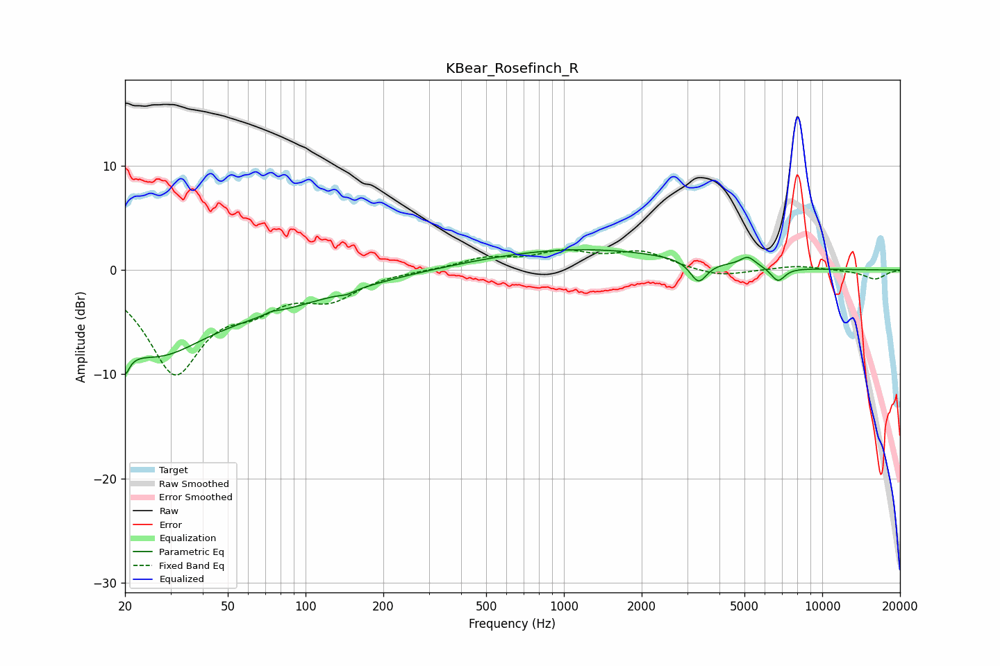

# KBear_Rosefinch_R
See [usage instructions](https://github.com/jaakkopasanen/AutoEq#usage) for more options and info.

### Parametric EQs
Apply preamp of -2.0 dB when using parametric equalizer.

|   # | Type    |   Fc (Hz) |    Q |   Gain (dB) |
|-----|---------|-----------|------|-------------|
|   1 | Peaking |        20 | 4.99 |        -7.1 |
|   2 | Peaking |        20 | 5.31 |         3.6 |
|   3 | Peaking |        26 | 0.77 |        -6.4 |
|   4 | Peaking |        68 | 0.42 |        -2.8 |
|   5 | Peaking |        74 | 5.98 |         0.2 |
|   6 | Peaking |       144 | 5.22 |        -0.3 |
|   7 | Peaking |      1149 | 0.37 |         2   |
|   8 | Peaking |      3322 | 4.35 |        -2.1 |
|   9 | Peaking |      5152 | 4.73 |         0.9 |
|  10 | Peaking |      6740 | 4.95 |        -1.4 |

### Fixed Band EQs
When using fixed band (also called graphic) equalizer, apply preamp of **-2.0 dB** (if available) and set gains manually with these parameters.

|   # | Type    |   Fc (Hz) |    Q |   Gain (dB) |
|-----|---------|-----------|------|-------------|
|   1 | Peaking |        31 | 1.41 |        -9.5 |
|   2 | Peaking |        62 | 1.41 |        -2.5 |
|   3 | Peaking |       125 | 1.41 |        -2.4 |
|   4 | Peaking |       250 | 1.41 |        -0   |
|   5 | Peaking |       500 | 1.41 |         1.1 |
|   6 | Peaking |      1000 | 1.41 |         1.5 |
|   7 | Peaking |      2000 | 1.41 |         1.6 |
|   8 | Peaking |      4000 | 1.41 |        -0.7 |
|   9 | Peaking |      8000 | 1.41 |         0.4 |
|  10 | Peaking |     16000 | 1.41 |        -0.9 |

### Graphs

