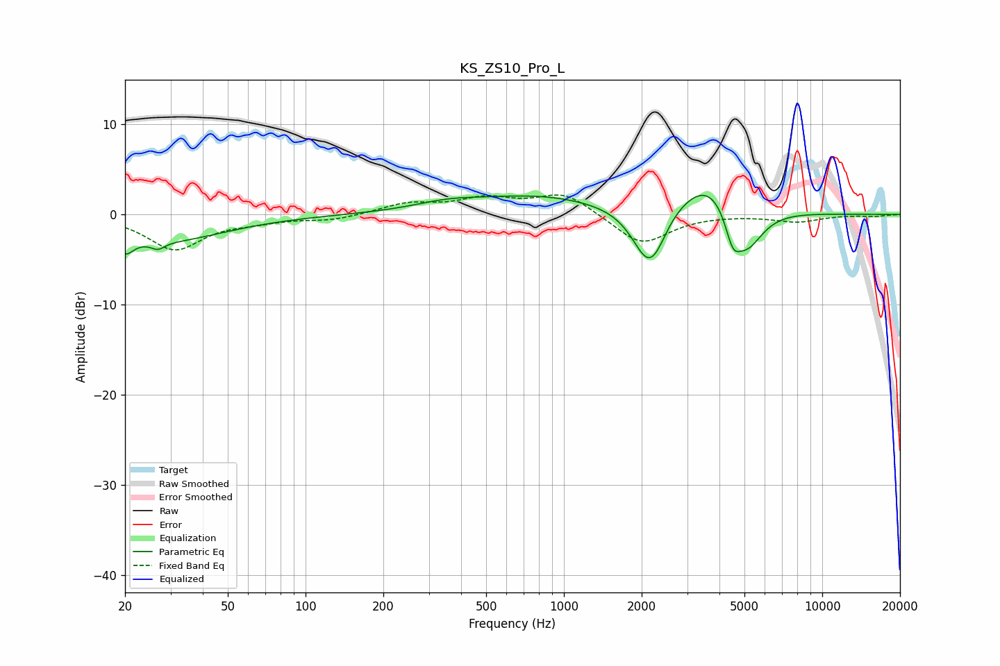

# KS_ZS10_Pro_L
See [usage instructions](https://github.com/jaakkopasanen/AutoEq#usage) for more options and info.

### Parametric EQs
Apply preamp of -2.2 dB when using parametric equalizer.

|   # | Type    |   Fc (Hz) |    Q |   Gain (dB) |
|-----|---------|-----------|------|-------------|
|   1 | Peaking |        20 | 4.39 |        -1.9 |
|   2 | Peaking |        27 | 5.52 |        -0.8 |
|   3 | Peaking |        28 | 0.6  |        -2.9 |
|   4 | Peaking |       354 | 1.06 |         0.8 |
|   5 | Peaking |       801 | 0.56 |         1.9 |
|   6 | Peaking |      2111 | 2.24 |        -6   |
|   7 | Peaking |      2280 | 3.61 |        -1   |
|   8 | Peaking |      3719 | 1.14 |         4.8 |
|   9 | Peaking |      4502 | 4.86 |        -3.1 |
|  10 | Peaking |      5074 | 2.08 |        -5.5 |

### Fixed Band EQs
When using fixed band (also called graphic) equalizer, apply preamp of **-2.3 dB** (if available) and set gains manually with these parameters.

|   # | Type    |   Fc (Hz) |    Q |   Gain (dB) |
|-----|---------|-----------|------|-------------|
|   1 | Peaking |        31 | 1.41 |        -3.8 |
|   2 | Peaking |        62 | 1.41 |        -0.6 |
|   3 | Peaking |       125 | 1.41 |        -0.6 |
|   4 | Peaking |       250 | 1.41 |         1.2 |
|   5 | Peaking |       500 | 1.41 |         1.6 |
|   6 | Peaking |      1000 | 1.41 |         2.4 |
|   7 | Peaking |      2000 | 1.41 |        -3.4 |
|   8 | Peaking |      4000 | 1.41 |         0   |
|   9 | Peaking |      8000 | 1.41 |        -0.8 |
|  10 | Peaking |     16000 | 1.41 |        -0.2 |

### Graphs

