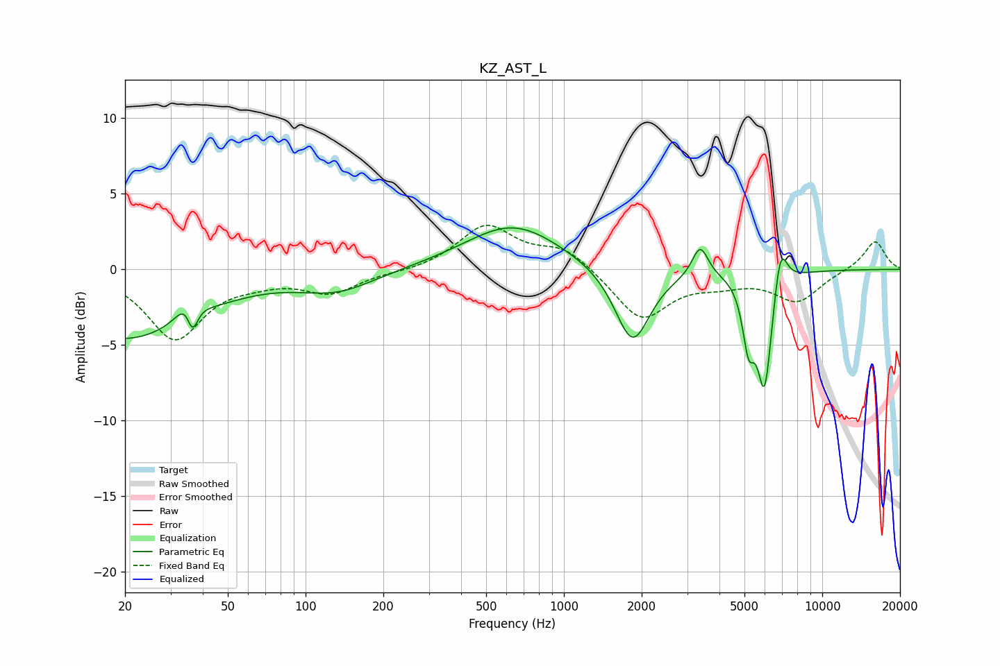

# KZ_AST_L
See [usage instructions](https://github.com/jaakkopasanen/AutoEq#usage) for more options and info.

### Parametric EQs
Apply preamp of -2.8 dB when using parametric equalizer.

|   # | Type    |   Fc (Hz) |    Q |   Gain (dB) |
|-----|---------|-----------|------|-------------|
|   1 | Peaking |        20 | 0.51 |        -4.6 |
|   2 | Peaking |        36 | 3.97 |         2.8 |
|   3 | Peaking |        36 | 6    |        -3.2 |
|   4 | Peaking |       133 | 0.95 |        -1.3 |
|   5 | Peaking |       635 | 0.77 |         3   |
|   6 | Peaking |      1844 | 2.08 |        -5.1 |
|   7 | Peaking |      3369 | 4.58 |         2.1 |
|   8 | Peaking |      5182 | 6    |        -3.8 |
|   9 | Peaking |      5982 | 4.71 |        -7.7 |
|  10 | Peaking |      6890 | 5.32 |         3   |

### Fixed Band EQs
When using fixed band (also called graphic) equalizer, apply preamp of **-3.0 dB** (if available) and set gains manually with these parameters.

|   # | Type    |   Fc (Hz) |    Q |   Gain (dB) |
|-----|---------|-----------|------|-------------|
|   1 | Peaking |        31 | 1.41 |        -4.5 |
|   2 | Peaking |        62 | 1.41 |        -0.5 |
|   3 | Peaking |       125 | 1.41 |        -1.5 |
|   4 | Peaking |       250 | 1.41 |        -0.2 |
|   5 | Peaking |       500 | 1.41 |         2.9 |
|   6 | Peaking |      1000 | 1.41 |         1.4 |
|   7 | Peaking |      2000 | 1.41 |        -3.3 |
|   8 | Peaking |      4000 | 1.41 |        -0.7 |
|   9 | Peaking |      8000 | 1.41 |        -2   |
|  10 | Peaking |     16000 | 1.41 |         1.9 |

### Graphs

