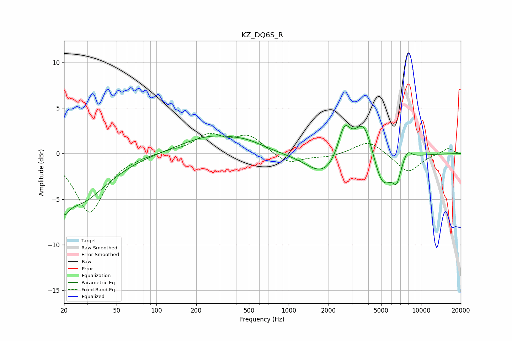

# KZ_DQ6S_R
See [usage instructions](https://github.com/jaakkopasanen/AutoEq#usage) for more options and info.

### Parametric EQs
Apply preamp of -3.2 dB when using parametric equalizer.

|   # | Type    |   Fc (Hz) |    Q |   Gain (dB) |
|-----|---------|-----------|------|-------------|
|   1 | Peaking |        20 | 4.34 |        -1.8 |
|   2 | Peaking |        25 | 0.67 |        -5.4 |
|   3 | Peaking |       266 | 0.6  |         1.9 |
|   4 | Peaking |       493 | 1.26 |         0.5 |
|   5 | Peaking |      1850 | 1.07 |        -2.5 |
|   6 | Peaking |      2627 | 3.03 |         3.4 |
|   7 | Peaking |      3716 | 1.92 |         4.6 |
|   8 | Peaking |      5102 | 1.82 |        -4.3 |
|   9 | Peaking |      6559 | 4.43 |        -2.1 |
|  10 | Peaking |      7884 | 3.82 |         1.1 |

### Fixed Band EQs
When using fixed band (also called graphic) equalizer, apply preamp of **-2.3 dB** (if available) and set gains manually with these parameters.

|   # | Type    |   Fc (Hz) |    Q |   Gain (dB) |
|-----|---------|-----------|------|-------------|
|   1 | Peaking |        31 | 1.41 |        -6.4 |
|   2 | Peaking |        62 | 1.41 |        -0.2 |
|   3 | Peaking |       125 | 1.41 |         0.3 |
|   4 | Peaking |       250 | 1.41 |         1.9 |
|   5 | Peaking |       500 | 1.41 |         1.9 |
|   6 | Peaking |      1000 | 1.41 |        -1.2 |
|   7 | Peaking |      2000 | 1.41 |        -0.4 |
|   8 | Peaking |      4000 | 1.41 |         1.5 |
|   9 | Peaking |      8000 | 1.41 |        -2.1 |
|  10 | Peaking |     16000 | 1.41 |         0.6 |

### Graphs

