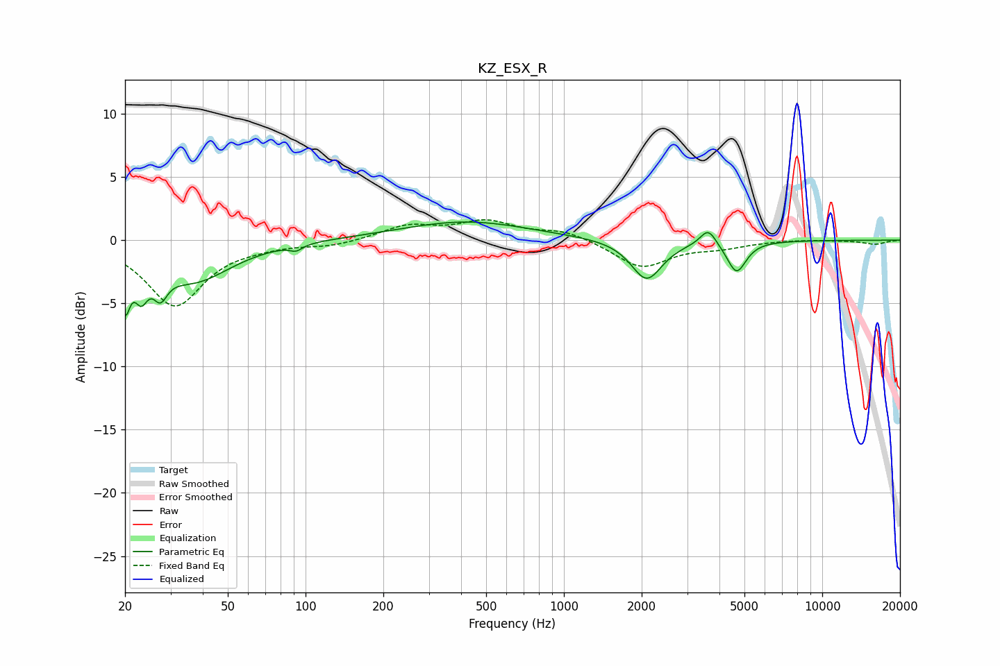

# KZ_ESX_R
See [usage instructions](https://github.com/jaakkopasanen/AutoEq#usage) for more options and info.

### Parametric EQs
Apply preamp of -1.5 dB when using parametric equalizer.

|   # | Type    |   Fc (Hz) |    Q |   Gain (dB) |
|-----|---------|-----------|------|-------------|
|   1 | Peaking |        20 | 5.86 |        -4.9 |
|   2 | Peaking |        21 | 5.93 |         1   |
|   3 | Peaking |        23 | 5.73 |        -2.3 |
|   4 | Peaking |        27 | 5.34 |        -1.9 |
|   5 | Peaking |        37 | 0.97 |        -3.2 |
|   6 | Peaking |        92 | 5.95 |        -0.4 |
|   7 | Peaking |       416 | 0.57 |         1.5 |
|   8 | Peaking |      2091 | 2.38 |        -3.2 |
|   9 | Peaking |      3621 | 4.56 |         1.4 |
|  10 | Peaking |      4659 | 3.86 |        -2.5 |

### Fixed Band EQs
When using fixed band (also called graphic) equalizer, apply preamp of **-1.7 dB** (if available) and set gains manually with these parameters.

|   # | Type    |   Fc (Hz) |    Q |   Gain (dB) |
|-----|---------|-----------|------|-------------|
|   1 | Peaking |        31 | 1.41 |        -5.2 |
|   2 | Peaking |        62 | 1.41 |        -0.3 |
|   3 | Peaking |       125 | 1.41 |        -0.4 |
|   4 | Peaking |       250 | 1.41 |         1.1 |
|   5 | Peaking |       500 | 1.41 |         1.4 |
|   6 | Peaking |      1000 | 1.41 |         0.7 |
|   7 | Peaking |      2000 | 1.41 |        -2.2 |
|   8 | Peaking |      4000 | 1.41 |        -0.5 |
|   9 | Peaking |      8000 | 1.41 |         0.1 |
|  10 | Peaking |     16000 | 1.41 |        -0.3 |

### Graphs

