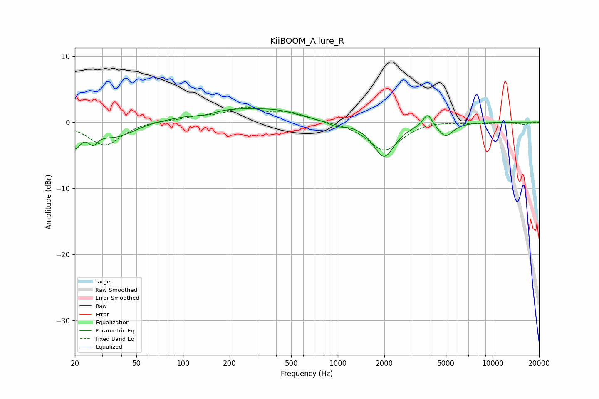

# KiiBOOM_Allure_R
See [usage instructions](https://github.com/jaakkopasanen/AutoEq#usage) for more options and info.

### Parametric EQs
Apply preamp of -2.1 dB when using parametric equalizer.

|   # | Type    |   Fc (Hz) |    Q |   Gain (dB) |
|-----|---------|-----------|------|-------------|
|   1 | Peaking |        20 | 3.88 |        -3.2 |
|   2 | Peaking |        26 | 4.52 |        -1.8 |
|   3 | Peaking |        37 | 1.21 |        -2.2 |
|   4 | Peaking |       140 | 1.92 |        -0.6 |
|   5 | Peaking |       184 | 0.59 |         1.9 |
|   6 | Peaking |       410 | 0.99 |         1.1 |
|   7 | Peaking |       980 | 2.81 |        -0.6 |
|   8 | Peaking |      1990 | 2.07 |        -5.2 |
|   9 | Peaking |      3811 | 4.89 |         2   |
|  10 | Peaking |      4977 | 3    |        -2   |

### Fixed Band EQs
When using fixed band (also called graphic) equalizer, apply preamp of **-2.4 dB** (if available) and set gains manually with these parameters.

|   # | Type    |   Fc (Hz) |    Q |   Gain (dB) |
|-----|---------|-----------|------|-------------|
|   1 | Peaking |        31 | 1.41 |        -3.6 |
|   2 | Peaking |        62 | 1.41 |         0.3 |
|   3 | Peaking |       125 | 1.41 |         0.7 |
|   4 | Peaking |       250 | 1.41 |         2   |
|   5 | Peaking |       500 | 1.41 |         1.3 |
|   6 | Peaking |      1000 | 1.41 |        -0   |
|   7 | Peaking |      2000 | 1.41 |        -4.3 |
|   8 | Peaking |      4000 | 1.41 |         0.3 |
|   9 | Peaking |      8000 | 1.41 |        -0.2 |
|  10 | Peaking |     16000 | 1.41 |        -0.3 |

### Graphs

