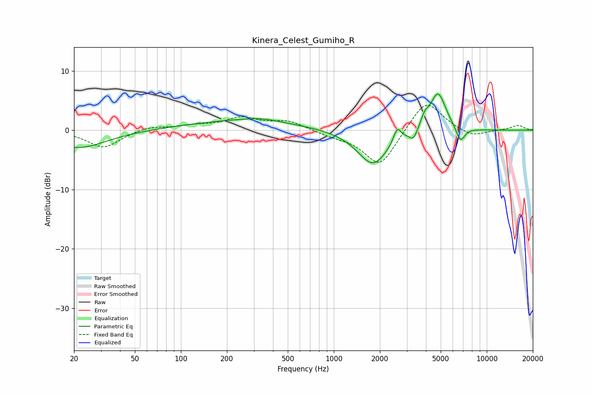

# Kinera_Celest_Gumiho_R
See [usage instructions](https://github.com/jaakkopasanen/AutoEq#usage) for more options and info.

### Parametric EQs
Apply preamp of -6.2 dB when using parametric equalizer.

|   # | Type    |   Fc (Hz) |    Q |   Gain (dB) |
|-----|---------|-----------|------|-------------|
|   1 | Peaking |        21 | 0.78 |        -3   |
|   2 | Peaking |       247 | 0.37 |         1.5 |
|   3 | Peaking |       332 | 1.16 |         0.6 |
|   4 | Peaking |      1801 | 1.41 |        -5.9 |
|   5 | Peaking |      2598 | 5.83 |         2.4 |
|   6 | Peaking |      3318 | 5.26 |        -1.7 |
|   7 | Peaking |      3923 | 5.39 |         1.5 |
|   8 | Peaking |      4802 | 2.58 |         7   |
|   9 | Peaking |      5123 | 1.27 |        -0.4 |
|  10 | Peaking |      6730 | 4.78 |        -2.6 |

### Fixed Band EQs
When using fixed band (also called graphic) equalizer, apply preamp of **-4.3 dB** (if available) and set gains manually with these parameters.

|   # | Type    |   Fc (Hz) |    Q |   Gain (dB) |
|-----|---------|-----------|------|-------------|
|   1 | Peaking |        31 | 1.41 |        -3   |
|   2 | Peaking |        62 | 1.41 |         0.7 |
|   3 | Peaking |       125 | 1.41 |         0.7 |
|   4 | Peaking |       250 | 1.41 |         2   |
|   5 | Peaking |       500 | 1.41 |         1.5 |
|   6 | Peaking |      1000 | 1.41 |        -0.7 |
|   7 | Peaking |      2000 | 1.41 |        -6.2 |
|   8 | Peaking |      4000 | 1.41 |         5.5 |
|   9 | Peaking |      8000 | 1.41 |        -1.2 |
|  10 | Peaking |     16000 | 1.41 |         0.8 |

### Graphs

