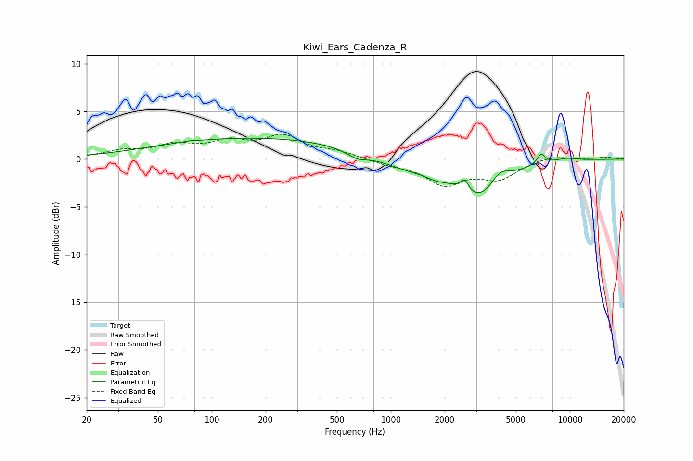

# Kiwi_Ears_Cadenza_R
See [usage instructions](https://github.com/jaakkopasanen/AutoEq#usage) for more options and info.

### Parametric EQs
Apply preamp of -2.3 dB when using parametric equalizer.

|   # | Type    |   Fc (Hz) |    Q |   Gain (dB) |
|-----|---------|-----------|------|-------------|
|   1 | Peaking |        76 | 5.75 |         0.1 |
|   2 | Peaking |       175 | 0.24 |         2.2 |
|   3 | Peaking |       648 | 2.4  |        -0.7 |
|   4 | Peaking |      1230 | 0.95 |        -1.1 |
|   5 | Peaking |      1787 | 2.58 |        -0.5 |
|   6 | Peaking |      2584 | 6    |         1.3 |
|   7 | Peaking |      3127 | 1.06 |        -4.1 |
|   8 | Peaking |      4056 | 2.65 |         1.5 |
|   9 | Peaking |      6911 | 6    |         1.1 |
|  10 | Peaking |      9557 | 2.04 |         0.3 |

### Fixed Band EQs
When using fixed band (also called graphic) equalizer, apply preamp of **-2.7 dB** (if available) and set gains manually with these parameters.

|   # | Type    |   Fc (Hz) |    Q |   Gain (dB) |
|-----|---------|-----------|------|-------------|
|   1 | Peaking |        31 | 1.41 |         0.8 |
|   2 | Peaking |        62 | 1.41 |         1.3 |
|   3 | Peaking |       125 | 1.41 |         1.5 |
|   4 | Peaking |       250 | 1.41 |         2.2 |
|   5 | Peaking |       500 | 1.41 |         0.7 |
|   6 | Peaking |      1000 | 1.41 |        -0.5 |
|   7 | Peaking |      2000 | 1.41 |        -2.5 |
|   8 | Peaking |      4000 | 1.41 |        -1.9 |
|   9 | Peaking |      8000 | 1.41 |         0.4 |
|  10 | Peaking |     16000 | 1.41 |         0.2 |

### Graphs

