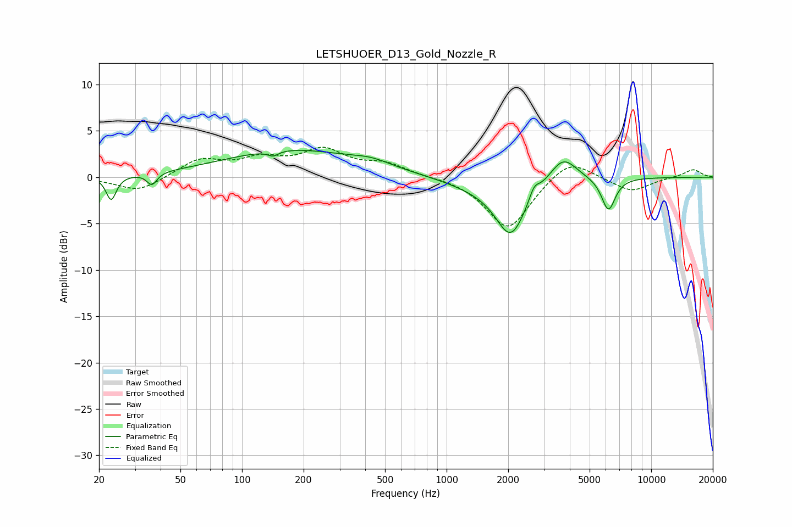

# LETSHUOER_D13_Gold_Nozzle_R
See [usage instructions](https://github.com/jaakkopasanen/AutoEq#usage) for more options and info.

### Parametric EQs
Apply preamp of -3.0 dB when using parametric equalizer.

|   # | Type    |   Fc (Hz) |    Q |   Gain (dB) |
|-----|---------|-----------|------|-------------|
|   1 | Peaking |        23 | 5.89 |        -2.6 |
|   2 | Peaking |        36 | 5.88 |        -1.3 |
|   3 | Peaking |       142 | 5.46 |        -0.6 |
|   4 | Peaking |       172 | 0.43 |         2.9 |
|   5 | Peaking |       432 | 1.4  |         0.7 |
|   6 | Peaking |      1392 | 0.91 |        -0.8 |
|   7 | Peaking |      2061 | 1.89 |        -5.9 |
|   8 | Peaking |      2678 | 6    |         1.2 |
|   9 | Peaking |      3709 | 2.11 |         2.7 |
|  10 | Peaking |      6179 | 4.06 |        -3.6 |

### Fixed Band EQs
When using fixed band (also called graphic) equalizer, apply preamp of **-3.3 dB** (if available) and set gains manually with these parameters.

|   # | Type    |   Fc (Hz) |    Q |   Gain (dB) |
|-----|---------|-----------|------|-------------|
|   1 | Peaking |        31 | 1.41 |        -1.6 |
|   2 | Peaking |        62 | 1.41 |         1.9 |
|   3 | Peaking |       125 | 1.41 |         1.7 |
|   4 | Peaking |       250 | 1.41 |         2.7 |
|   5 | Peaking |       500 | 1.41 |         1.3 |
|   6 | Peaking |      1000 | 1.41 |         0.1 |
|   7 | Peaking |      2000 | 1.41 |        -5.7 |
|   8 | Peaking |      4000 | 1.41 |         2.3 |
|   9 | Peaking |      8000 | 1.41 |        -1.6 |
|  10 | Peaking |     16000 | 1.41 |         0.9 |

### Graphs

