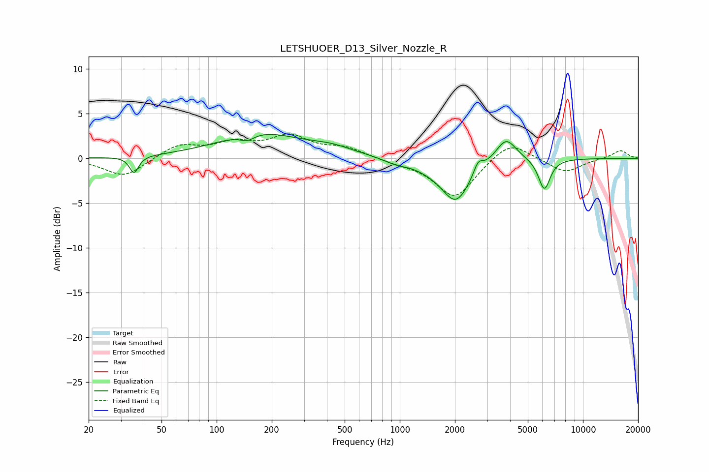

# LETSHUOER_D13_Silver_Nozzle_R
See [usage instructions](https://github.com/jaakkopasanen/AutoEq#usage) for more options and info.

### Parametric EQs
Apply preamp of -2.8 dB when using parametric equalizer.

|   # | Type    |   Fc (Hz) |    Q |   Gain (dB) |
|-----|---------|-----------|------|-------------|
|   1 | Peaking |        35 | 5.91 |        -1.9 |
|   2 | Peaking |       147 | 3.56 |        -0.7 |
|   3 | Peaking |       172 | 0.62 |         2.8 |
|   4 | Peaking |       426 | 1.17 |         0.7 |
|   5 | Peaking |       944 | 2.35 |        -0.4 |
|   6 | Peaking |      1495 | 1.24 |        -0.7 |
|   7 | Peaking |      2030 | 1.83 |        -4.5 |
|   8 | Peaking |      2680 | 5.86 |         1.3 |
|   9 | Peaking |      3804 | 2.5  |         2.6 |
|  10 | Peaking |      6153 | 4.25 |        -3.5 |

### Fixed Band EQs
When using fixed band (also called graphic) equalizer, apply preamp of **-2.8 dB** (if available) and set gains manually with these parameters.

|   # | Type    |   Fc (Hz) |    Q |   Gain (dB) |
|-----|---------|-----------|------|-------------|
|   1 | Peaking |        31 | 1.41 |        -2.1 |
|   2 | Peaking |        62 | 1.41 |         1.5 |
|   3 | Peaking |       125 | 1.41 |         1.5 |
|   4 | Peaking |       250 | 1.41 |         2.3 |
|   5 | Peaking |       500 | 1.41 |         1.1 |
|   6 | Peaking |      1000 | 1.41 |        -0.4 |
|   7 | Peaking |      2000 | 1.41 |        -4.4 |
|   8 | Peaking |      4000 | 1.41 |         2.1 |
|   9 | Peaking |      8000 | 1.41 |        -1.6 |
|  10 | Peaking |     16000 | 1.41 |         0.9 |

### Graphs

