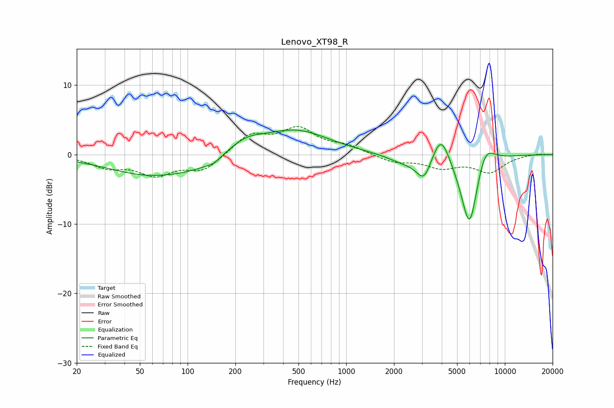

# Lenovo_XT98_R
See [usage instructions](https://github.com/jaakkopasanen/AutoEq#usage) for more options and info.

### Parametric EQs
Apply preamp of -3.6 dB when using parametric equalizer.

|   # | Type    |   Fc (Hz) |    Q |   Gain (dB) |
|-----|---------|-----------|------|-------------|
|   1 | Peaking |        59 | 0.51 |        -3   |
|   2 | Peaking |       111 | 1.06 |        -0.7 |
|   3 | Peaking |       145 | 2.92 |        -0.7 |
|   4 | Peaking |       233 | 1.33 |         1.7 |
|   5 | Peaking |       477 | 0.67 |         3.5 |
|   6 | Peaking |      2322 | 1.32 |        -1.1 |
|   7 | Peaking |      3092 | 2.99 |        -3.3 |
|   8 | Peaking |      3954 | 2.55 |         4.5 |
|   9 | Peaking |      5990 | 2.41 |       -11.3 |
|  10 | Peaking |      7472 | 2.26 |         3.7 |

### Fixed Band EQs
When using fixed band (also called graphic) equalizer, apply preamp of **-4.1 dB** (if available) and set gains manually with these parameters.

|   # | Type    |   Fc (Hz) |    Q |   Gain (dB) |
|-----|---------|-----------|------|-------------|
|   1 | Peaking |        31 | 1.41 |        -1.6 |
|   2 | Peaking |        62 | 1.41 |        -2.7 |
|   3 | Peaking |       125 | 1.41 |        -2.3 |
|   4 | Peaking |       250 | 1.41 |         2.8 |
|   5 | Peaking |       500 | 1.41 |         3.5 |
|   6 | Peaking |      1000 | 1.41 |         1.1 |
|   7 | Peaking |      2000 | 1.41 |        -1.1 |
|   8 | Peaking |      4000 | 1.41 |        -1.7 |
|   9 | Peaking |      8000 | 1.41 |        -2.4 |
|  10 | Peaking |     16000 | 1.41 |         0.2 |

### Graphs

