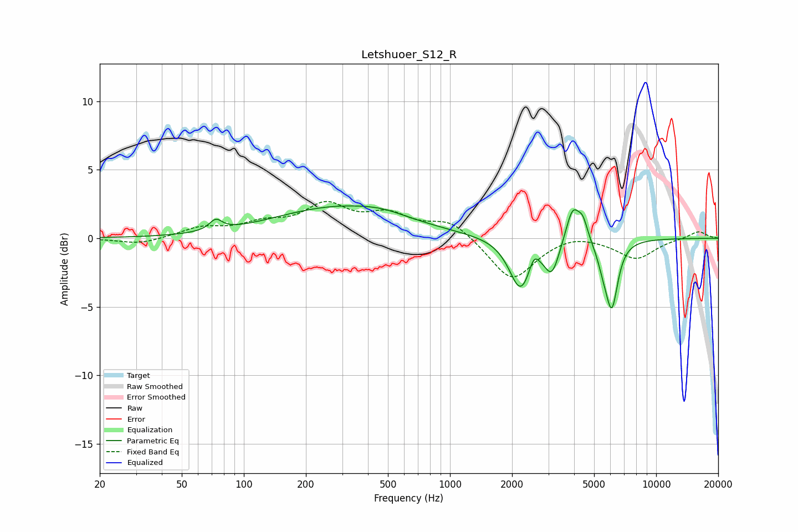

# Letshuoer_S12_R
See [usage instructions](https://github.com/jaakkopasanen/AutoEq#usage) for more options and info.

### Parametric EQs
Apply preamp of -2.5 dB when using parametric equalizer.

|   # | Type    |   Fc (Hz) |    Q |   Gain (dB) |
|-----|---------|-----------|------|-------------|
|   1 | Peaking |        73 | 4.63 |         0.8 |
|   2 | Peaking |       292 | 0.44 |         2.2 |
|   3 | Peaking |       468 | 1.31 |         0.3 |
|   4 | Peaking |      2202 | 2.62 |        -3.8 |
|   5 | Peaking |      2551 | 6    |         1.1 |
|   6 | Peaking |      3123 | 3.98 |        -2.2 |
|   7 | Peaking |      3940 | 4.22 |         2.6 |
|   8 | Peaking |      4413 | 5.99 |         1.3 |
|   9 | Peaking |      5528 | 5    |        -1.1 |
|  10 | Peaking |      6095 | 4.69 |        -4.7 |

### Fixed Band EQs
When using fixed band (also called graphic) equalizer, apply preamp of **-2.8 dB** (if available) and set gains manually with these parameters.

|   # | Type    |   Fc (Hz) |    Q |   Gain (dB) |
|-----|---------|-----------|------|-------------|
|   1 | Peaking |        31 | 1.41 |        -0.5 |
|   2 | Peaking |        62 | 1.41 |         0.7 |
|   3 | Peaking |       125 | 1.41 |         0.9 |
|   4 | Peaking |       250 | 1.41 |         2.2 |
|   5 | Peaking |       500 | 1.41 |         1.5 |
|   6 | Peaking |      1000 | 1.41 |         1.3 |
|   7 | Peaking |      2000 | 1.41 |        -3.1 |
|   8 | Peaking |      4000 | 1.41 |         0.4 |
|   9 | Peaking |      8000 | 1.41 |        -1.5 |
|  10 | Peaking |     16000 | 1.41 |         0.5 |

### Graphs

