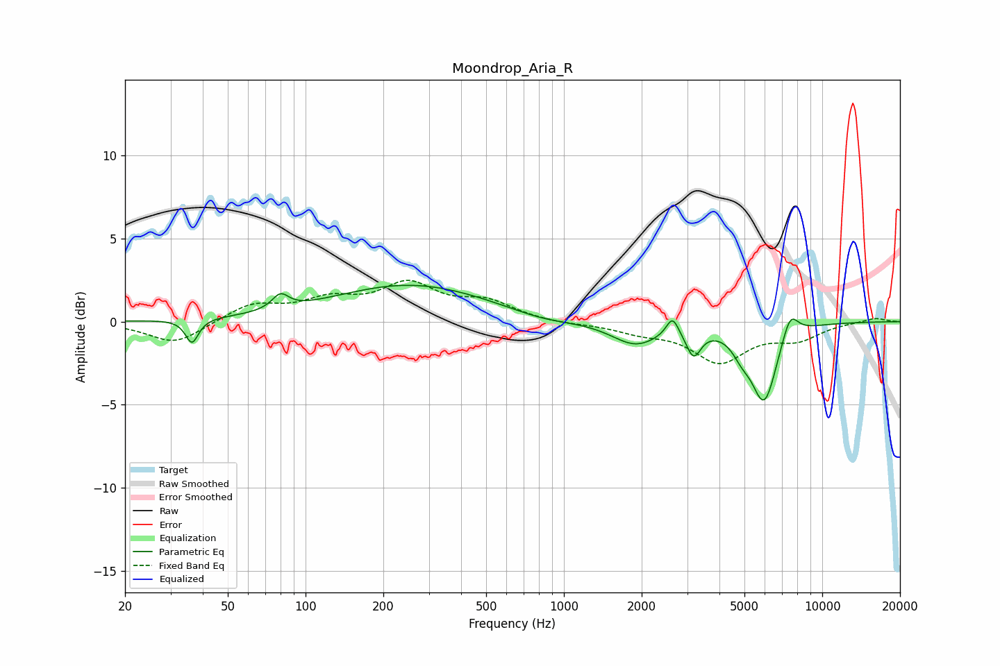

# Moondrop_Aria_R
See [usage instructions](https://github.com/jaakkopasanen/AutoEq#usage) for more options and info.

### Parametric EQs
Apply preamp of -2.3 dB when using parametric equalizer.

|   # | Type    |   Fc (Hz) |    Q |   Gain (dB) |
|-----|---------|-----------|------|-------------|
|   1 | Peaking |        36 | 5.86 |        -1.5 |
|   2 | Peaking |        80 | 4.45 |         0.9 |
|   3 | Peaking |       256 | 0.46 |         2.2 |
|   4 | Peaking |       826 | 1.11 |        -0.4 |
|   5 | Peaking |      1890 | 1.52 |        -1.4 |
|   6 | Peaking |      2633 | 6    |         1.2 |
|   7 | Peaking |      3178 | 5.07 |        -1.6 |
|   8 | Peaking |      4876 | 3.83 |        -0.9 |
|   9 | Peaking |      5961 | 2.76 |        -4.7 |
|  10 | Peaking |      7511 | 4.24 |         1.6 |

### Fixed Band EQs
When using fixed band (also called graphic) equalizer, apply preamp of **-2.6 dB** (if available) and set gains manually with these parameters.

|   # | Type    |   Fc (Hz) |    Q |   Gain (dB) |
|-----|---------|-----------|------|-------------|
|   1 | Peaking |        31 | 1.41 |        -1.4 |
|   2 | Peaking |        62 | 1.41 |         1   |
|   3 | Peaking |       125 | 1.41 |         1.1 |
|   4 | Peaking |       250 | 1.41 |         2.1 |
|   5 | Peaking |       500 | 1.41 |         1.1 |
|   6 | Peaking |      1000 | 1.41 |        -0.1 |
|   7 | Peaking |      2000 | 1.41 |        -0.5 |
|   8 | Peaking |      4000 | 1.41 |        -2.3 |
|   9 | Peaking |      8000 | 1.41 |        -0.9 |
|  10 | Peaking |     16000 | 1.41 |         0.3 |

### Graphs

