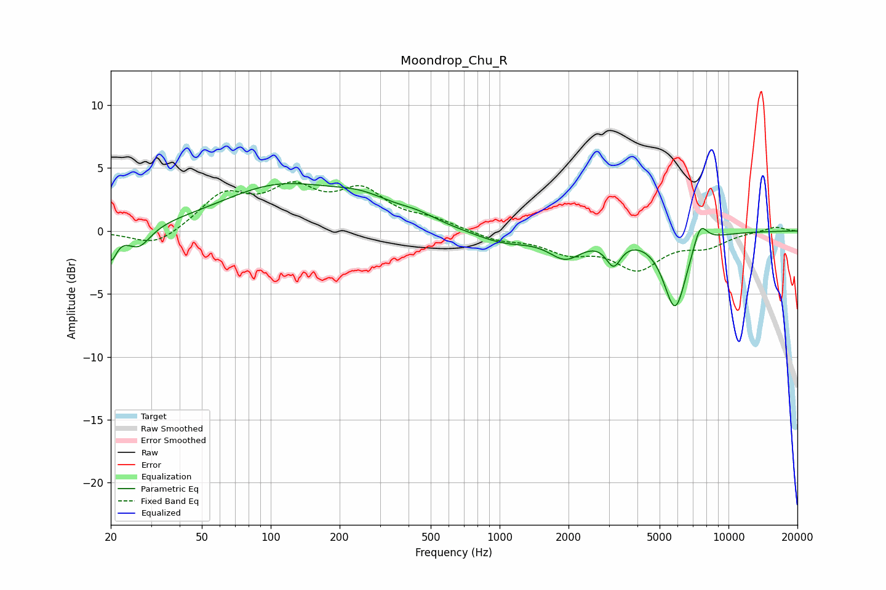

# Moondrop_Chu_R
See [usage instructions](https://github.com/jaakkopasanen/AutoEq#usage) for more options and info.

### Parametric EQs
Apply preamp of -3.9 dB when using parametric equalizer.

|   # | Type    |   Fc (Hz) |    Q |   Gain (dB) |
|-----|---------|-----------|------|-------------|
|   1 | Peaking |        20 | 5.71 |        -2.2 |
|   2 | Peaking |        27 | 2.74 |        -1.7 |
|   3 | Peaking |       109 | 0.54 |         3.4 |
|   4 | Peaking |       252 | 1.03 |         1.4 |
|   5 | Peaking |       436 | 1.56 |         0.6 |
|   6 | Peaking |      1038 | 1.11 |        -0.9 |
|   7 | Peaking |      1940 | 1.94 |        -1.8 |
|   8 | Peaking |      3146 | 4.31 |        -2   |
|   9 | Peaking |      5848 | 2.7  |        -6.1 |
|  10 | Peaking |      7525 | 4.35 |         1.9 |

### Fixed Band EQs
When using fixed band (also called graphic) equalizer, apply preamp of **-4.0 dB** (if available) and set gains manually with these parameters.

|   # | Type    |   Fc (Hz) |    Q |   Gain (dB) |
|-----|---------|-----------|------|-------------|
|   1 | Peaking |        31 | 1.41 |        -1.3 |
|   2 | Peaking |        62 | 1.41 |         2.7 |
|   3 | Peaking |       125 | 1.41 |         2.9 |
|   4 | Peaking |       250 | 1.41 |         2.9 |
|   5 | Peaking |       500 | 1.41 |         0.7 |
|   6 | Peaking |      1000 | 1.41 |        -0.7 |
|   7 | Peaking |      2000 | 1.41 |        -1.4 |
|   8 | Peaking |      4000 | 1.41 |        -2.8 |
|   9 | Peaking |      8000 | 1.41 |        -1.1 |
|  10 | Peaking |     16000 | 1.41 |         0.4 |

### Graphs

