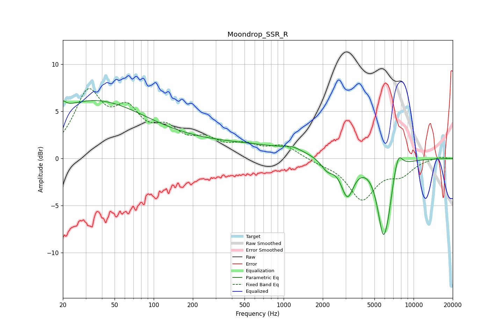

# Moondrop_SSR_R
See [usage instructions](https://github.com/jaakkopasanen/AutoEq#usage) for more options and info.

### Parametric EQs
Apply preamp of -6.2 dB when using parametric equalizer.

|   # | Type    |   Fc (Hz) |    Q |   Gain (dB) |
|-----|---------|-----------|------|-------------|
|   1 | Peaking |        20 | 6    |         5.2 |
|   2 | Peaking |        20 | 6    |        -4.3 |
|   3 | Peaking |        32 | 0.36 |         5.7 |
|   4 | Peaking |       276 | 0.2  |         1.6 |
|   5 | Peaking |      1166 | 2.21 |         0.4 |
|   6 | Peaking |      2167 | 2.91 |        -1.1 |
|   7 | Peaking |      3095 | 2.91 |        -3.7 |
|   8 | Peaking |      5857 | 3.06 |        -7.7 |
|   9 | Peaking |      6460 | 5.16 |        -1.1 |
|  10 | Peaking |      7626 | 4.17 |         1.9 |

### Fixed Band EQs
When using fixed band (also called graphic) equalizer, apply preamp of **-7.5 dB** (if available) and set gains manually with these parameters.

|   # | Type    |   Fc (Hz) |    Q |   Gain (dB) |
|-----|---------|-----------|------|-------------|
|   1 | Peaking |        31 | 1.41 |         6.5 |
|   2 | Peaking |        62 | 1.41 |         4.2 |
|   3 | Peaking |       125 | 1.41 |         2.4 |
|   4 | Peaking |       250 | 1.41 |         1.6 |
|   5 | Peaking |       500 | 1.41 |         1.2 |
|   6 | Peaking |      1000 | 1.41 |         1.3 |
|   7 | Peaking |      2000 | 1.41 |        -0.4 |
|   8 | Peaking |      4000 | 1.41 |        -4.2 |
|   9 | Peaking |      8000 | 1.41 |        -1.5 |
|  10 | Peaking |     16000 | 1.41 |         0.2 |

### Graphs

