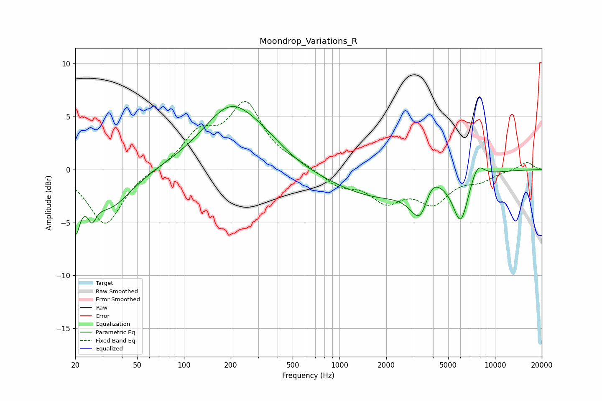

# Moondrop_Variations_R
See [usage instructions](https://github.com/jaakkopasanen/AutoEq#usage) for more options and info.

### Parametric EQs
Apply preamp of -6.1 dB when using parametric equalizer.

|   # | Type    |   Fc (Hz) |    Q |   Gain (dB) |
|-----|---------|-----------|------|-------------|
|   1 | Peaking |        20 | 4.92 |        -4.3 |
|   2 | Peaking |        26 | 5.21 |        -1.8 |
|   3 | Peaking |        33 | 1.01 |        -3.6 |
|   4 | Peaking |       202 | 0.76 |         5.9 |
|   5 | Peaking |       338 | 1.16 |         0.7 |
|   6 | Peaking |      1730 | 0.48 |        -2.5 |
|   7 | Peaking |      3350 | 2.24 |        -4.2 |
|   8 | Peaking |      3810 | 2.18 |         2.7 |
|   9 | Peaking |      6019 | 2.76 |        -4.4 |
|  10 | Peaking |      7699 | 2.96 |         1.6 |

### Fixed Band EQs
When using fixed band (also called graphic) equalizer, apply preamp of **-6.5 dB** (if available) and set gains manually with these parameters.

|   # | Type    |   Fc (Hz) |    Q |   Gain (dB) |
|-----|---------|-----------|------|-------------|
|   1 | Peaking |        31 | 1.41 |        -5.2 |
|   2 | Peaking |        62 | 1.41 |        -0   |
|   3 | Peaking |       125 | 1.41 |         3.1 |
|   4 | Peaking |       250 | 1.41 |         5.9 |
|   5 | Peaking |       500 | 1.41 |         0.4 |
|   6 | Peaking |      1000 | 1.41 |        -1.4 |
|   7 | Peaking |      2000 | 1.41 |        -2.7 |
|   8 | Peaking |      4000 | 1.41 |        -2.8 |
|   9 | Peaking |      8000 | 1.41 |        -0.9 |
|  10 | Peaking |     16000 | 1.41 |         0.7 |

### Graphs

