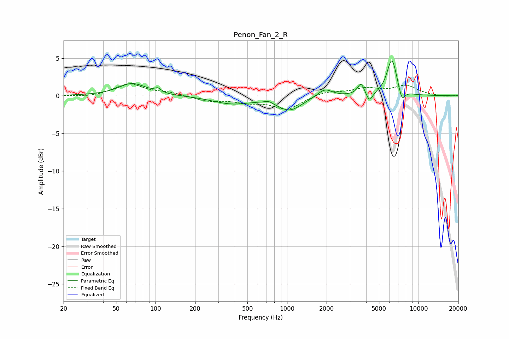

# Penon_Fan_2_R
See [usage instructions](https://github.com/jaakkopasanen/AutoEq#usage) for more options and info.

### Parametric EQs
Apply preamp of -4.7 dB when using parametric equalizer.

|   # | Type    |   Fc (Hz) |    Q |   Gain (dB) |
|-----|---------|-----------|------|-------------|
|   1 | Peaking |        67 | 1.37 |         1.6 |
|   2 | Peaking |       104 | 6    |         0.5 |
|   3 | Peaking |       379 | 0.97 |        -1   |
|   4 | Peaking |       724 | 4.83 |         0.3 |
|   5 | Peaking |      1048 | 1.53 |        -1.8 |
|   6 | Peaking |      1939 | 2.58 |         1.1 |
|   7 | Peaking |      3653 | 5.47 |         1.6 |
|   8 | Peaking |      4231 | 5.99 |        -1.3 |
|   9 | Peaking |      6273 | 3.61 |         4.9 |
|  10 | Peaking |      7475 | 5.73 |        -1.7 |

### Fixed Band EQs
When using fixed band (also called graphic) equalizer, apply preamp of **-1.7 dB** (if available) and set gains manually with these parameters.

|   # | Type    |   Fc (Hz) |    Q |   Gain (dB) |
|-----|---------|-----------|------|-------------|
|   1 | Peaking |        31 | 1.41 |        -0.2 |
|   2 | Peaking |        62 | 1.41 |         1.6 |
|   3 | Peaking |       125 | 1.41 |         0.4 |
|   4 | Peaking |       250 | 1.41 |        -0.7 |
|   5 | Peaking |       500 | 1.41 |        -0.7 |
|   6 | Peaking |      1000 | 1.41 |        -1.8 |
|   7 | Peaking |      2000 | 1.41 |         0.6 |
|   8 | Peaking |      4000 | 1.41 |         0.9 |
|   9 | Peaking |      8000 | 1.41 |         1.3 |
|  10 | Peaking |     16000 | 1.41 |        -0.1 |

### Graphs

